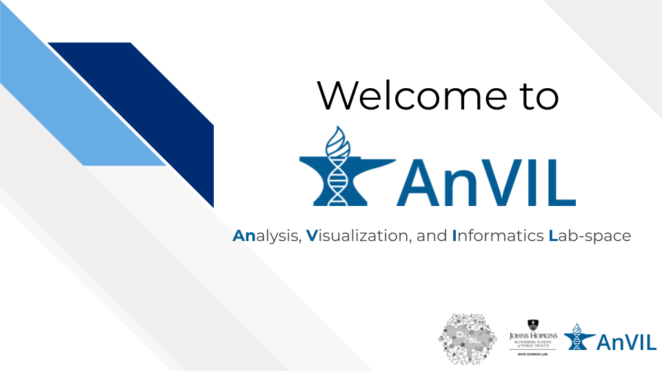

# (PART\*) Welcome to AnVIL {-}   

# Overview

## Background

Over the past 20 years, there has been tremendous growth in human genomics, with millions of human genomes sequenced and many more to come in the future. This data, along with other biomedical information, has the potential to greatly improve our understanding of healthy living and transform healthcare. To achieve these goals, we need new approaches to research that involve cloud computing, which is the only way to effectively share and analyze data at this scale. The traditional method of genomic data sharing through centralized data warehouses is becoming unsustainable and inefficient. It creates redundant infrastructure and administrative inefficiencies that make collaborative analysis challenging, especially as datasets increase in size. This approach also leads to high transfer and download costs and poses security and compliance risks.

The NHGRI Genomic Data Science Analysis, Visualization, and Informatics Lab-Space, or AnVIL, inverts the traditional model, providing a cloud environment for the analysis of large genomic and related datasets. By providing a secure, unified environment for data management and compute, AnVIL eliminates the need for data movement, allows for active threat detection and monitoring, and provides elastic, shared computing resources that can be acquired as needed. 

AnVIL currently provides secure access to hundreds of thousands of NHGRI datasets spanning nearly 5 petabytes of data and is built from a set of established components that are accessed and connected through the AnVIL Portal at https://anvilproject.org/ . The AnVIL homepage provides researchers an entry point into these tools, along with documentation, data browser, and links to related resources. 

<iframe width="560" height="315" src="https://www.youtube.com/embed/XC5qzj-yZb8" title="YouTube video player" frameborder="0" allow="accelerometer; autoplay; clipboard-write; encrypted-media; gyroscope; picture-in-picture" allowfullscreen></iframe>

## About this Demo

The Welcome to AnVIL demo provides an overview of the AnVIL platform, its purpose, and how it can benefit researchers and the broader genomics community. We highlight some of the historic challenges of analyzing and sharing large-scale genomic data and describe how AnVIL provides a cloud-based solution for accessing and analyzing such data. We also cover key features and functionalities of AnVIL, including its compatibility with popular analysis tools/ Finally, we emphasize the importance of collaboration and community engagement in driving AnVIL's development and future growth, providing resources to customize your journey with AnVIL.

## Skills Level

::: {.notice}
_Genetics_

**Novice**: no genetics knowledge needed

_Programming skills_

**Novice**: no programming experience needed
:::

## Learning Objectives

1. Understand the benefits of using cloud computing for genomic data analysis and the limitations of traditional data-sharing paradigms.

1. Identify the main features and tools available on the AnVIL platform and their potential applications in genomics research.

1. Learn how to navigate and access a Workspace, the starting point for a basic analysis using the AnVIL tools.

1. Identify potential use cases for the AnVIL platform in your own research projects.

1. Learn about additional resources to self-guide your discovery on AnVIL.

## Timeline

| Activity | Duration |
| :-- | :-- |
| [Introduction](https://docs.google.com/presentation/d/1wTcGBM-ZOo7SmyR7x_BCvau2bBig01Er59s4lXb1Bg4/edit#slide=id.p) | 3 minutes |
| [Why AnVIL](https://docs.google.com/presentation/d/1wTcGBM-ZOo7SmyR7x_BCvau2bBig01Er59s4lXb1Bg4/edit#slide=id.g21756f91cc3_2_5) | 5 minutes |
| [What is AnVIL](https://docs.google.com/presentation/d/1wTcGBM-ZOo7SmyR7x_BCvau2bBig01Er59s4lXb1Bg4/edit#slide=id.g21756f91cc3_2_26) | 7 minutes |
| [Use Cases](https://docs.google.com/presentation/d/1wTcGBM-ZOo7SmyR7x_BCvau2bBig01Er59s4lXb1Bg4/edit#slide=id.g21756f91cc3_2_44) | 3 minutes |
| [Getting Started](https://docs.google.com/presentation/d/1wTcGBM-ZOo7SmyR7x_BCvau2bBig01Er59s4lXb1Bg4/edit#slide=id.g21756f91cc3_2_15) | 2 minutes |
| Q & A | 10 minutes |
| **Total** | 30 minutes |

# Google Slides

The following link provides a link to Google Slides for this demo: https://docs.google.com/presentation/d/1wTcGBM-ZOo7SmyR7x_BCvau2bBig01Er59s4lXb1Bg4/edit?usp=sharing

 

# Demo Recording

Please check out our recording of this demo here:

<iframe width="560" height="315" src="https://www.youtube.com/embed/fcMUU7NrEeM" title="YouTube video player" frameborder="0" allow="accelerometer; autoplay; clipboard-write; encrypted-media; gyroscope; picture-in-picture; web-share" allowfullscreen></iframe>

