# (PART\*) What is AnVIL {-}   

# Overview {#what-is-anvil-overview}

## Background

Over the past 20 years, there has been tremendous growth in human genomics, with millions of human genomes sequenced and many more to come in the future. This data, along with other biomedical information, has the potential to greatly improve our understanding of healthy living and transform healthcare. To achieve these goals, we need new approaches to research that involve cloud computing, which is the only way to effectively share and analyze data at this scale. The traditional method of genomic data sharing through centralized data warehouses is becoming unsustainable and inefficient. It creates redundant infrastructure and administrative inefficiencies that make collaborative analysis challenging, especially as datasets increase in size. This approach also leads to high transfer and download costs and poses security and compliance risks.

The NHGRI Genomic Data Science Analysis, Visualization, and Informatics Lab-Space, or AnVIL, inverts the traditional model, providing a cloud environment for the analysis of large genomic and related datasets. By providing a secure, unified environment for data management and compute, AnVIL eliminates the need for data movement, allows for active threat detection and monitoring, and provides elastic, shared computing resources that can be acquired as needed. 

AnVIL currently provides secure access to hundreds of thousands of NHGRI datasets spanning nearly 5 petabytes of data and is built from a set of established components that are accessed and connected through the AnVIL Portal at https://anvilproject.org/ . The AnVIL homepage provides researchers an entry point into these tools, along with documentation, data browser, and links to related resources. 

<iframe width="560" height="315" src="https://www.youtube.com/embed/XC5qzj-yZb8" title="YouTube video player" frameborder="0" allow="accelerometer; autoplay; clipboard-write; encrypted-media; gyroscope; picture-in-picture" allowfullscreen></iframe>

## About this Demo

The Welcome to AnVIL demo provides an overview of the AnVIL platform, its purpose, and how it can benefit researchers and the broader genomics community. We highlight some of the historic challenges of analyzing and sharing large-scale genomic data and describe how AnVIL provides a cloud-based solution for accessing and analyzing such data. We also cover key features and functionalities of AnVIL, including its compatibility with popular analysis tools/ Finally, we emphasize the importance of collaboration and community engagement in driving AnVIL's development and future growth, providing resources to customize your journey with AnVIL.

## Skills Level

::: {.notice}
_Genetics_

**Novice**: no genetics knowledge needed

_Programming skills_

**Novice**: no programming experience needed
:::

## Learning Objectives

1. Understand the benefits of using cloud computing for genomic data analysis and the limitations of traditional data-sharing paradigms.

1. Identify the main features and tools available on the AnVIL platform and their potential applications in genomics research.

1. Learn how to navigate and access a Workspace, the starting point for a basic analysis using the AnVIL tools.

1. Identify potential use cases for the AnVIL platform in your own research projects.

1. Learn about additional resources to self-guide your discovery on AnVIL.

# Preparation {#what-is-anvil-preparation}

## Review Key Concepts

Learn about why AnVIL has been created, what features AnVIL offers, how AnVIL is being used, and how to get started in this ~20 min video ([slides](https://docs.google.com/presentation/d/1wTcGBM-ZOo7SmyR7x_BCvau2bBig01Er59s4lXb1Bg4))

<iframe width="560" height="315" src="https://www.youtube.com/embed/fcMUU7NrEeM" title="YouTube video player" frameborder="0" allow="accelerometer; autoplay; clipboard-write; encrypted-media; gyroscope; picture-in-picture; web-share" allowfullscreen></iframe>

# Exercises {#what-is-anvil-exercises}

## Launch Terra

Go to [anvilproject.org](https://anvilproject.org), find the box that says Terra, and click on "Launch".

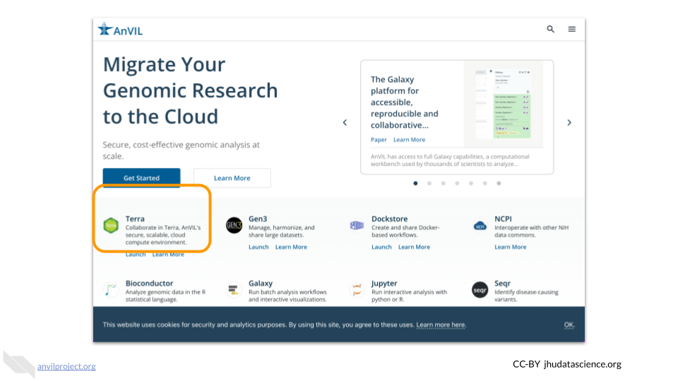
Next, you will need Log in. 


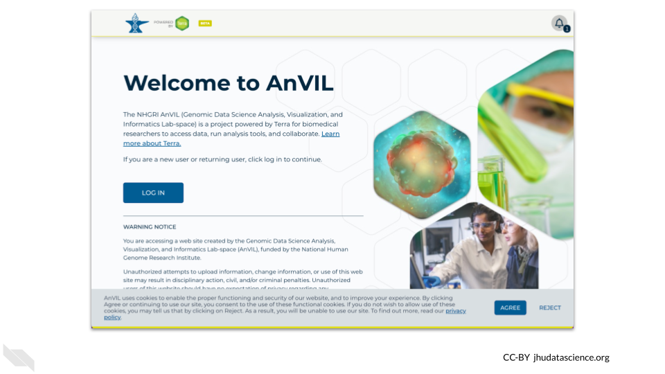


If you have never used AnVIL before, you will need to create a new account. You can use a [Google or Institutional account](https://support.terra.bio/hc/en-us/articles/360028235911-How-to-register-on-Terra-Google-SSO) to log in. Otherwise if you already have an account, you can skip ahead to the [next section](#clone-hprc-workspace). 

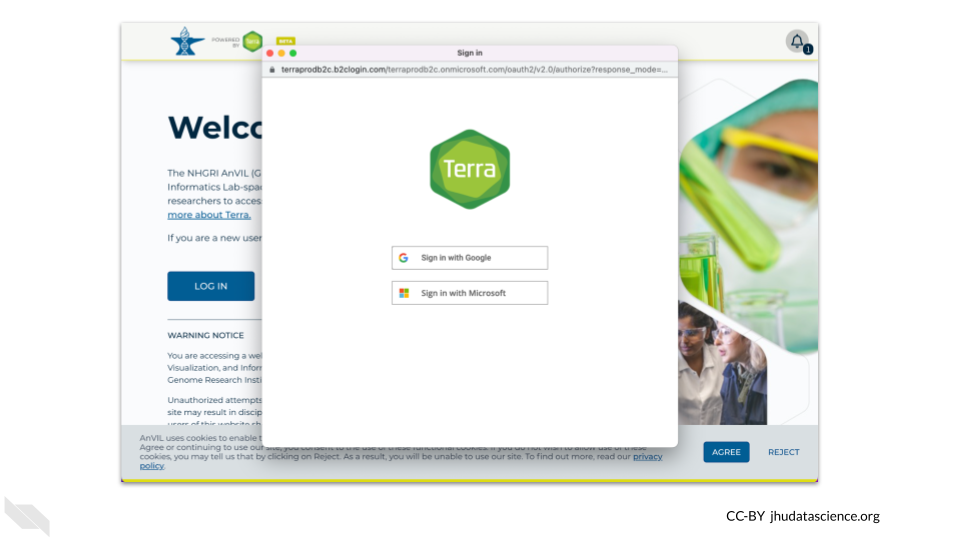

To create an account you will need to supply some information and read the Terra Terms of Service. 

If you accept the Terms of Service, check the box for agreement and the register button will become active.

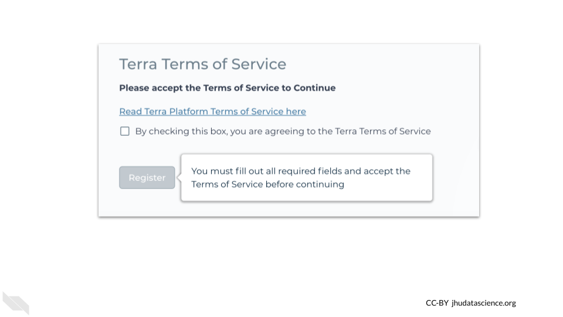

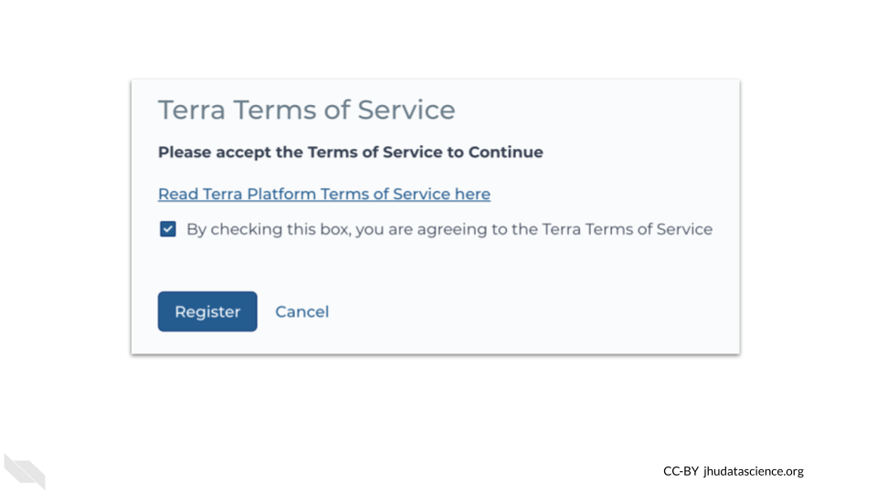

This will open a new tab for you of the AnVIL workspaces, now you are ready to start working in AnVIL!


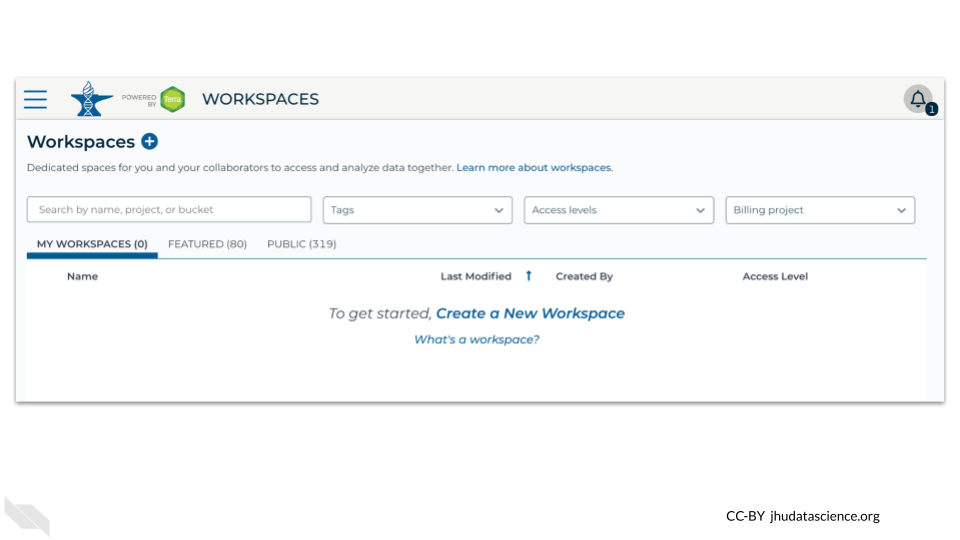


## Clone HPRC Workspace{#clone-hprc-workspace}

At [anvil.terra.bio/#workspaces](https://anvil.terra.bio/#workspaces):

- Enter `hprc` in the search box
- Click on the "Public" tab
- Find the AnVIL_HPRC workspace
- Click on the circle with three vertical dots on the right side of the workspace information window

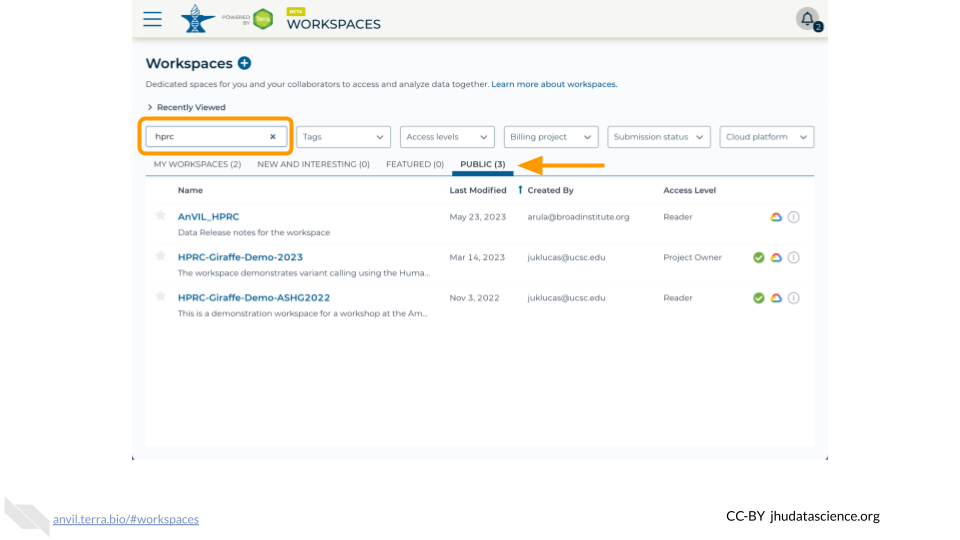


Select "Clone" from the menu options.


::: {.notice}
You can also directly access the workspace going to this link: https://anvil.terra.bio/#workspaces/anvil-datastorage/AnVIL_HPRC
:::

If you have set up billing before, you can skip ahead to the [Starting a cloud environment section](#start-a-cloud-environment).

If your instructor has provided a billing project, you can skip to the [Use a billing project section](#use-a-billing-project).

### First Time Billing Setup


If this is your first time on AnVIL, you will likely get a message that you need to start a Google Cloud billing account.

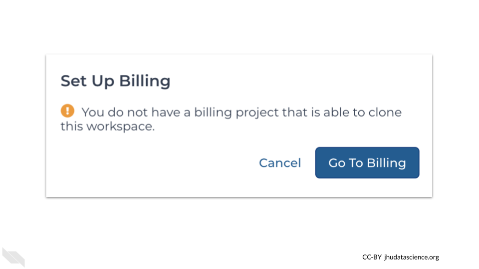


This will open a new page about linking a Google Cloud billing account to Terra. Click on the "Go to Google Cloud Console" button.

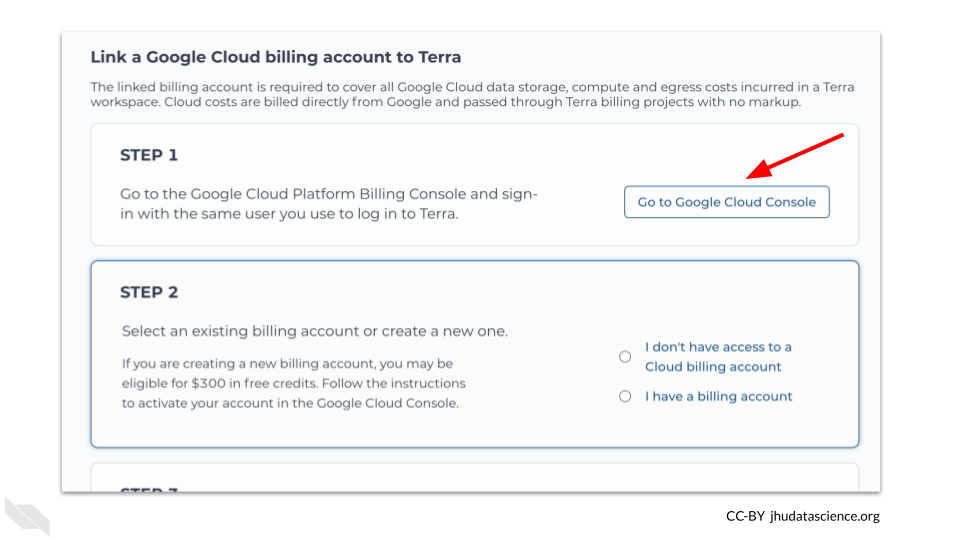

You may get a warning that you also need to set up two factor authentication. If so, please do so with your credentials. If you run into challenges, try one of your other accounts in which you have full administrative access.

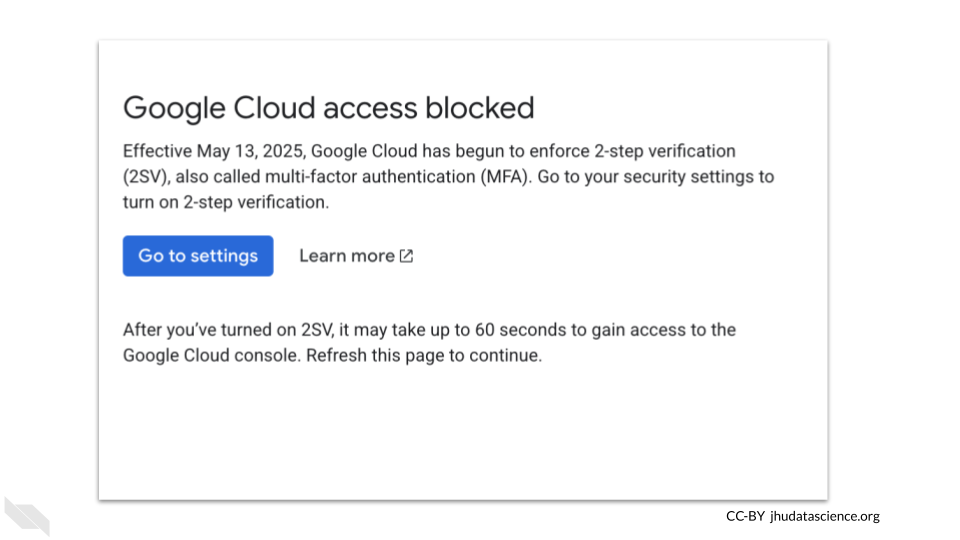


Otherwise, or after you set up two factor authentication, you should get a message about having some free credits to use. Select to allow for any needed authorization and then click on the button that says "Try for free".

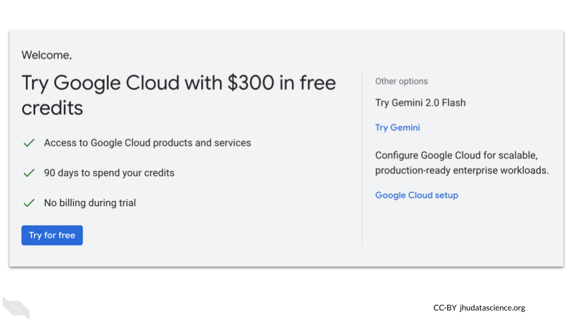


You will then need to set up your payment information. Don't worry, you will not be exceeding the free credit amount, so you will not actually be charged!

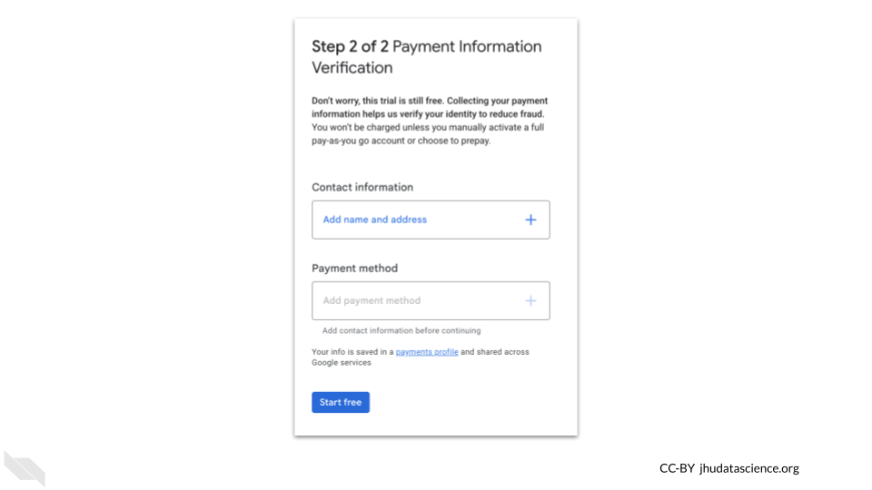

Once you do this, you will see a "Start free" button become active.


You will then see a message confirming you set up your account and have free credits. 

Next you will need to add Terra to your billing account. Follow [Step 2](https://support.terra.bio/hc/en-us/articles/360026182251-How-to-set-up-billing-in-Terra-GCP#h_94f3a2f9-6c06-4ea7-9892-2df158c47788) in this guide to do so. Note that you will need to select "Project Billing Manager" instead though.

It may take a few minutes for these changes to become active, but then you can go back to AnVIL and check that you have added a billing manager for Step 2.

For this STEP 2, you will select "I have a billing account".

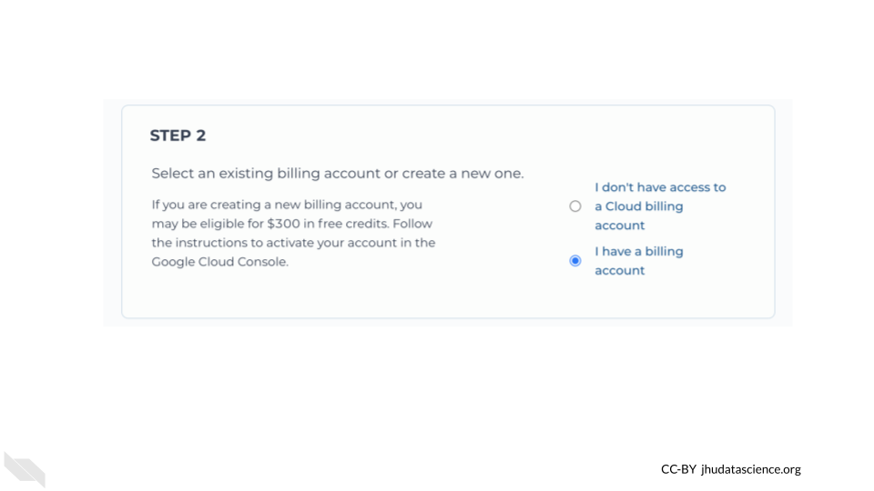

Next for STEP 3, check that you have added terra as a billing manager.

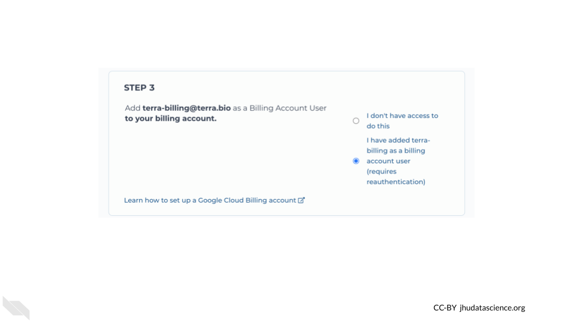

You will need to authenticate the connection with Terra again.

Finally you will do STEP 4 to create a Terra billing project. If step 4 has a warning about your account not being set up right, you may need to click the refresh button that is in the warning. 


::: {.notice}

Your instructor will provide information about the billing account that you should use and will set you up with one.

:::


## Use a Billing Project{#use-a-billing-project}

Now you may or may not yet have access visible on this screen, but go back to clone the workspace using the menu on the far left of the AnVIL_HPRC workspace. This time, clicking on clone should pull up a new window that asks for the billing project. Select the account that your instructor told you about, and do not change the other settings.


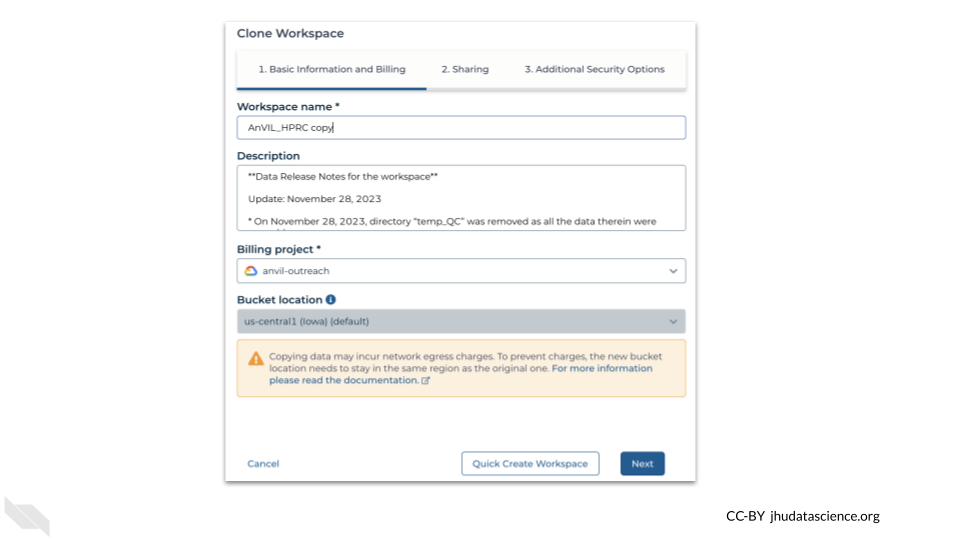

Leave everything on the next two screens (sharing and Extra Security Options) as is as well.

Finally, click the blue "Create Workspace" button in the lower right corner on the Extra Security Options screen.

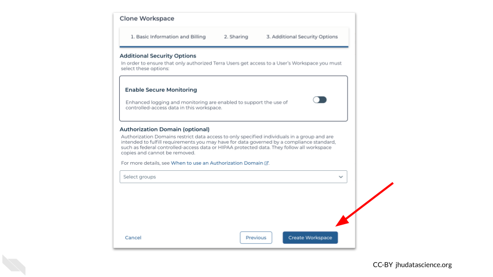


## Start a Cloud Environment{#start-a-cloud-environment}

- Click on the Environment Configuration (cloud icon)
- Select Jupyter Settings
- Scroll down and click "Create"

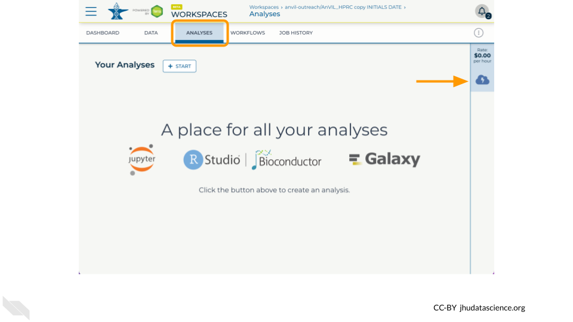

## Find Tidbits

- In the Dashboard tab, what are three types of sequencing data that are available?
- In the Data tab `participant` table, what two superpopulations have the most participants?
- In the Data tab `sample` table, how many samples lack any ilmn data?
- In the Data tab `assembly_sample` table, what is the command to download the HG002 `mat_fasta` file?

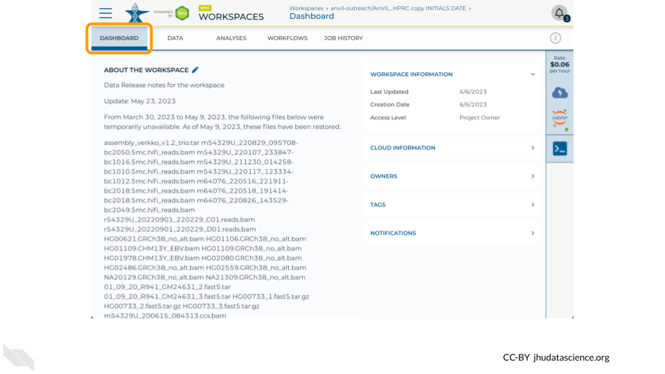

## Enter Terminal

- In the Analysis tab, click on Terminal
- Make a working copy of the HG002 `mat_fasta`
    - NOTE: Requester pays buckets require `-u <google-project-id>` [[ref](https://support.terra.bio/hc/en-us/articles/360029801491)]
- Examine file with `ls -l` and `zcat *.fa.gz | head`

```
gsutil cp 'gs://fc-4310e737-a388-4a10-8c9e-babe06aaf0cf/working/HPRC_PLUS/HG002/assemblies/year1_f1_assembly_v2_genbank/HG002.maternal.f1_assembly_v2_genbank.fa.gz' .
```

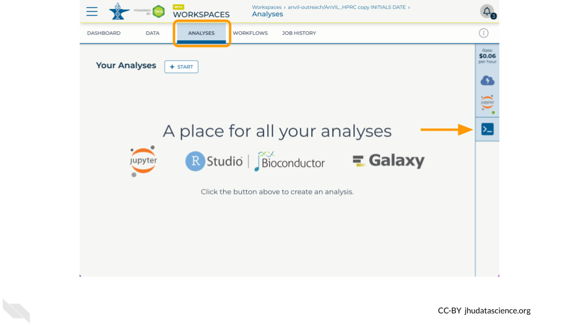

## Shut Down

- Click on the Environment Configuration (cloud icon)
- Select Jupyter Settings
- Scroll down and click "Delete Environment"
- Select "Delete" after deciding to keep or delete your persistent disk
- Click "hamburger" icon in the upper left, expand your name, select Cloud Environments and confirm no unnecessary resources are running

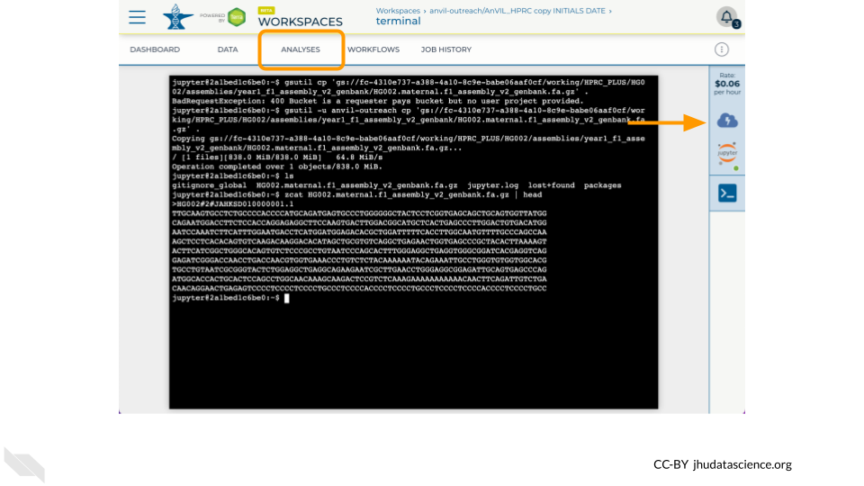

# Instructor Guide {#what-is-anvil-instructor-guide}

## Timeline

Here is one possible way to budget time for a synchronous event:

| Activity | Duration |
| :-- | :-- |
| Review Key Concepts | 15 min |
| Q & A | 5 min |
| Exercises | 15 min |
| Q & A | 5 min |

Here is one way to balance exercises between hands-on (HO) and follow-along (FA):

| Activity | Style |
| :-- | :-- |
| Launch Terra | HO |
| Clone HPRC Workspace | HO |
| Start a Cloud Environment | FA |
| Find Tidbits | HO |
| Enter Terminal | FA |
| Shut Down | FA |

