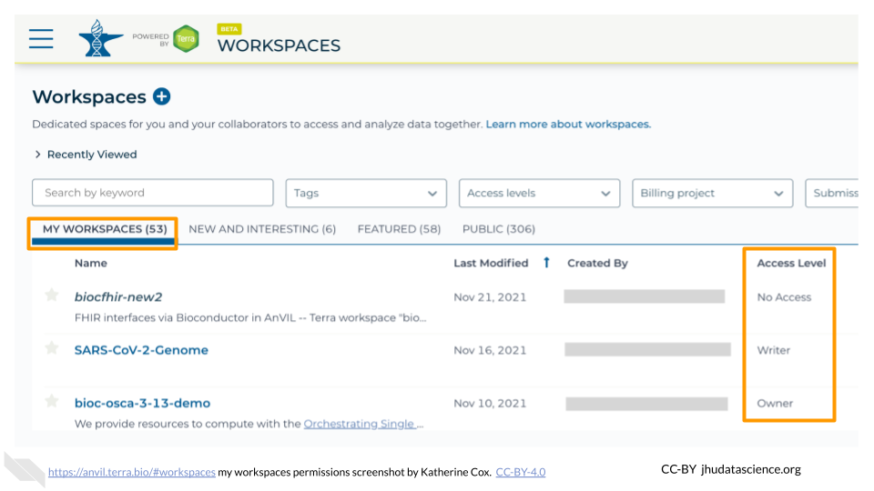
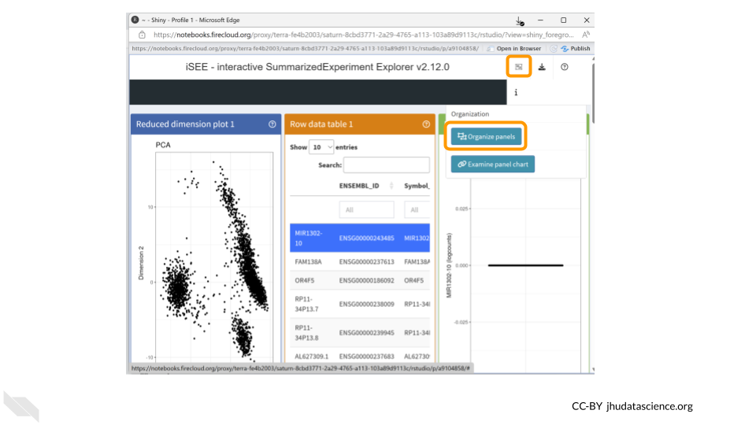
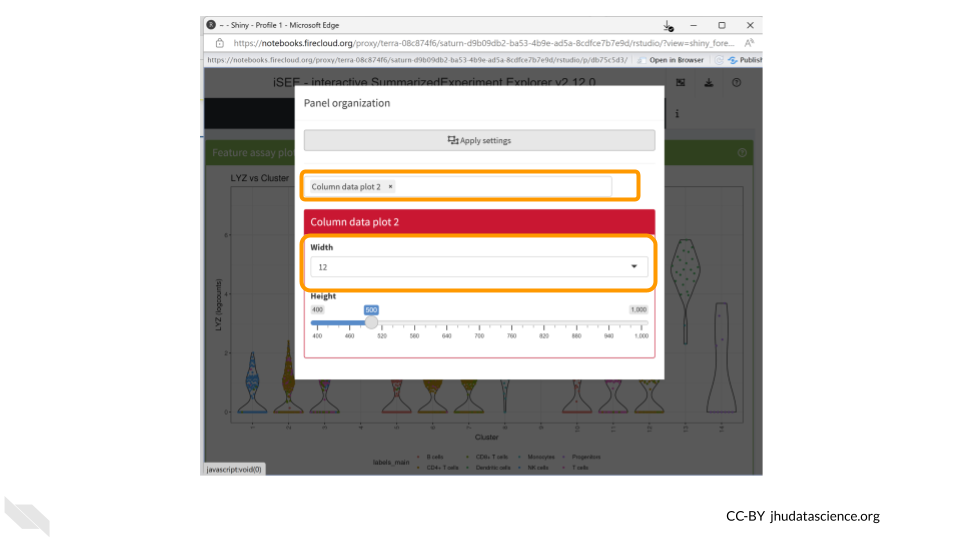
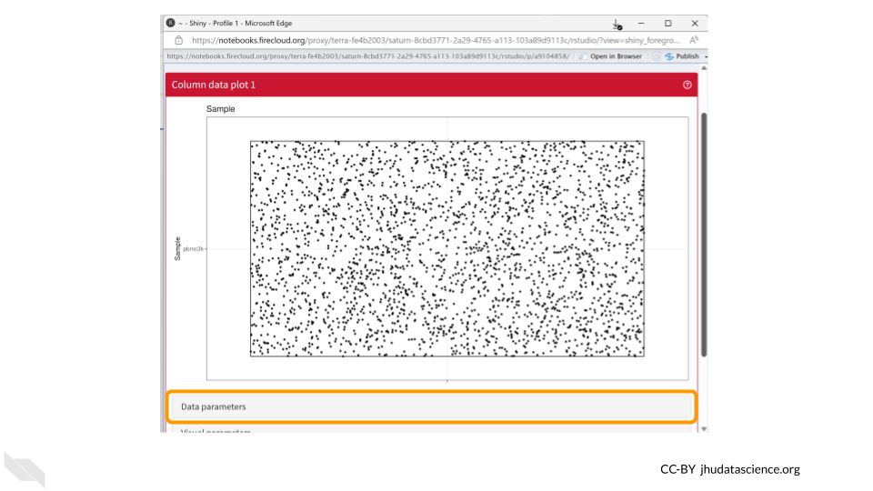
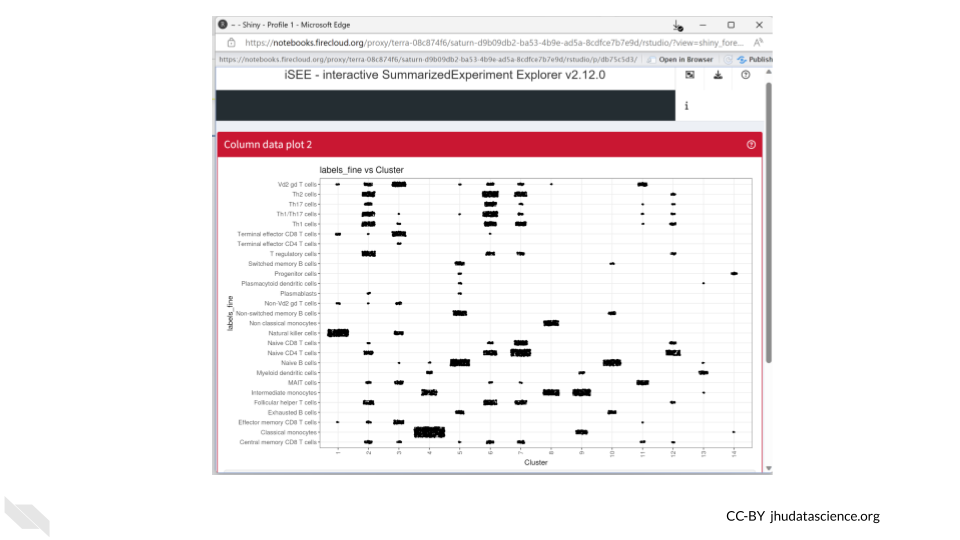
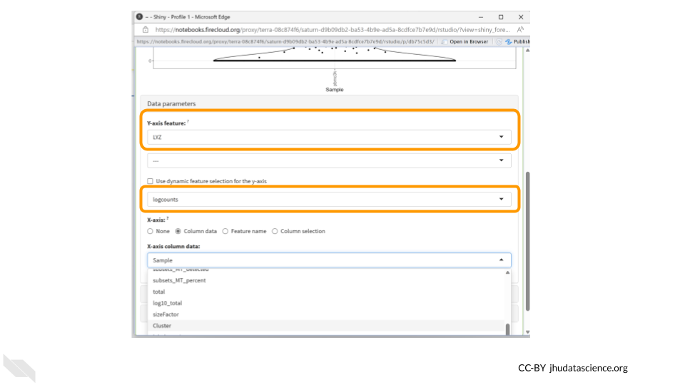
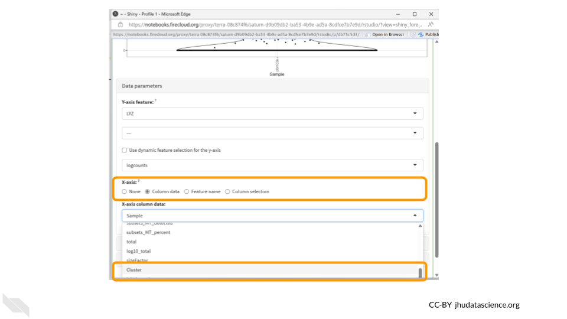
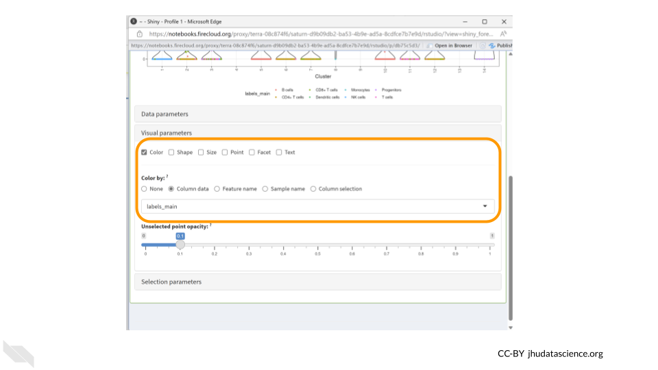

# (PART\*) Single Cell with Bioconductor {-}   

# Overview {#single-cell-with-bioconductor-overview}

The `iSEE` Bioconductor package is a powerful tool for visualizing and exploring single-cell RNA-seq data. The iSEE viewer provides an interactive interface for exploring gene expression patterns, performing dimensionality reduction, clustering cells, visualizing metadata, and conducting differential expression analysis. 

In this demo, we'll learn how to launch the iSEE viewer in AnVIL's RStudio environment.

## Skills Level

::: {.notice}
_Genetics_

**Beginner**: some genetics knowledge helpful

_Programming skills_

**Beginner**: some programming experience helpful
:::

## Learning Objectives

1. Launch Terra
1. Clone Workspace
1. Launch RStudio-Bioconductor maintained cloud environment
1. Launch iSEE viewer
1. Create plots for investigating expression of different cell types
1. Shut down RStudio

# Preparation {#single-cell-with-bioconductor-preparation}

If you plan to follow along with these exercises, there are a couple of things you will need to take care of first:

## Review Background

If you aren't already familiar with RStudio, Bioconductor, and single cell RNA sequencing data analysis, we encourage you to check out our background slides [here](https://docs.google.com/presentation/d/18J1x5rkWJisiv3EOMVZOma52XWxAVKANTg0Q2FXbOWU/edit?usp=sharing).

## Create AnVIL account

You will need an AnVIL account in order to view Workspaces and run analyses.

- If you do not already have an account, follow [these instructions](https://jhudatascience.org/AnVIL_Book_Getting_Started/overview-analysts.html) to set one up.  (You do not need to link any external accounts for these exercises.)
- Make sure that your Instructor (if participating in a workshop) or PI / Lab Manager has your username, so that they can add you to an appropriate *Billing Project*.  You can't clone or create Workspaces on AnVIL without a Billing Project.

## Clone Workspace

When you "clone" a copy of an AnVIL Workspace, it can take a few minutes for everything to propagate to your new Workspace. If you are participating in a course or workshop, your instructor may have you start by cloning the Workspace, so that it is ready by the time you need it. (If you are working at your own pace, feel free to come back to this step later, when you're ready to start using the Workspace.)

Follow the instructions below to clone your own copy of the Workspace for this Demo.

:::: {.borrowed_chunk}

:::{.warning}
This **will not work** until your instructor has given you permission to spend money to "rent" the computers that will power your analyses (by adding you to a "Billing Project").
:::

On AnVIL, you access files and computers through **Workspaces**.  Each Workspace functions almost like a mini code laboratory - it is a place where data can be examined, stored, and analyzed. The first thing we want to do is to copy or “clone” a Workspace to create a space for you to experiment.  This will give you access to

- the files you will need (data, code)
- the computing environment you will use

:::{.notice}
**Tip**
At this point, it might make things easier to open up a new window in your browser and split your screen. That way, you can follow along with this guide on one side and execute the steps on the other.
:::

To clone an AnVIL Workspace:

1. Open Terra - use a web browser to go to [`anvil.terra.bio`](https://anvil.terra.bio/)

1. In the drop-down menu on the left, navigate to "Workspaces". Click the triple bar in the top left corner to access the menu. Click "Workspaces".

    

1. You are automatically directed to the "MY WORKSPACES" tab.  Here you can see any Workspaces that have been shared with you, along with your permission level.  Depending on how your instructor has set things up, you may or may not see any Workspaces in this tab.

    
    
1. Locate the Workspace **demos-combine-data-workspaces**.  (The images below show the SARS-CoV-2-Genome Workspace as an example, but you should look for the Workspace  **demos-combine-data-workspaces**.)
    a. If it has been shared with you ahead of time, it will appear in "MY WORKSPACES".  

    
    b. Otherwise, select the "PUBLIC" tab.  In the top search bar, type the Workspace name **demos-combine-data-workspaces**.

    
    c. You can also go directly to the Workspace by clicking this link: https://anvil.terra.bio/#workspaces/anvil-outreach/demos-combine-data-workspaces.
    
1. Clone the workspace by clicking the teardrop button ({width=25px}). Select "Clone".  Or, if you have opened the Workspace, you can find the teardrop button on the top right of the Workspace.

    
    

1. You will see a popup box appear, asking you to configure your Workspace
    a. Give your Workspace clone a name by adding an underscore ("_") and your name. For example, \"demos-combine-data-workspaces_Firstname_Lastname\".
    a. Select the Billing Project provided by your instructor.
    a. Leave the bottom two boxes as-is.
    a. Click “CLONE WORKSPACE”.
    
    

1. The new Workspace should now show up under "MY WORKSPACES".  You now have your own copy of the Workspace to work in.
::::

Now your Workspace should be ready for you by the time you need it below.  You are ready to begin!

## Start Cloud Environment

You will need to launch the interactive RStudio environment to proceed.

### Video Overview


Here is a video tutorial that describes the basics of using RStudio on AnVIL.

<iframe src="https://drive.google.com/file/d/1v72ZG8JIRDUaewFQgGfcCO_qoM4eYmYX/preview" width="640" height="360" allow="autoplay"></iframe>

### Objectives

- Start compute for your RStudio environment
- Tour RStudio on AnVIL
- Stop compute to minimize expenses

### Slides

The slides for this tutorial are are located [here](https://docs.google.com/presentation/d/1eypYLLqD11-NwHLs4adGpcuSB07dYEJfAaALSMvgzqw).

### Launching RStudio


:::{.warning}
AnVIL is very versatile and can scale up to use very powerful cloud computers. It's very important that you select a cloud computing environment appropriate to your needs to avoid runaway costs.  If you are uncertain, start with the default settings; it is fairly easy to increase your compute resources later, if needed, but harder to scale down.
:::

Note that, in order to use RStudio, you must have access to a Terra Workspace with permission to compute (i.e. you must be a "Writer" or "Owner" of the Workspace).

1. Open Terra - use a web browser to go to [`anvil.terra.bio`](https://anvil.terra.bio/)

1. In the drop-down menu on the left, navigate to "Workspaces". Click the triple bar in the top left corner to access the menu. Click "Workspaces".

    

1. Click on the name of your Workspace. You should be routed to a link that looks like: `https://anvil.terra.bio/#workspaces/<billing-project>/<workspace-name>`.

1. Click on the cloud icon on the far right to access your Cloud Environment options.  If you don’t see this icon, you may need to scroll to the right.

    

1. In the dialogue box, click the "Settings" button under RStudio.

    

1. You will see some configuration options for the RStudio cloud environment, and a list of costs because it costs a small amount of money to use cloud computing.

    


1. Configure any settings you need for your cloud environment.  If you are uncertain about what you need, the default configuration is a reasonable, cost-conservative choice.  It is fairly easy to increase your compute resources later, if needed, but harder to scale down. Scroll down and click the "CREATE" button when you are satisfied with your setup.

    

    

    

    

    

    

    

1. The dialogue box will close and you will be returned to your Workspace.  You can see the status of your cloud environment by hovering over the RStudio icon.  It will take a few minutes for Terra to request computers and install software.

    

1. When your environment is ready, its status will change to "Running".  Click on the RStudio logo to open a new dialogue box that will let you launch RStudio.

    
    
1. Click the launch icon to open RStudio.  This is also where you can pause, modify, or delete your environment when needed.

    

1. You should now see the RStudio interface with information about the version printed to the console.

    

# Exercises {#single-cell-with-bioconductor-exercises}

The following exercises will walk you through the process of using iSEE to explore single cell RNA-seq data. You will use data that have already been prepared and is saved in a SingleCellExperiment object. You will use the `pbmc3k` dataset from the `TENxPBMCData` package, which contains gene expression profiles for 2,700 single peripheral blood mononuclear cells. Information on how the data were preprocessed can be found [here](https://isee.github.io/iSEEWorkshopEuroBioc2020/articles/dataset.html).

These exercises were adapted from [iSEEWorkshopEuroBioc2020/](https://isee.github.io/iSEEWorkshopEuroBioc2020/).

:::{.notice}
To follow along with these exercises, you will need to complete the steps described in the [Preparation](#scale-with-workflows-preparation) guide for this demo.
:::

## Loading the Data

First, we'll want to load the data that we'll be using. To do that, we'll need to load the `AnVIL` package created by the Bioconductor team for interfacing with files on AnVIL. Luckily, it's already installed.


``` r
library(AnVIL)
```

Next, we'll use the `avfiles_restore()` function from the `AnVIL` package to actually bring the data into our environment's persistent disk. 


``` r
avfiles_restore( 
  source = "sc_bioconductor_data.RData",
  namespace = "anvil-outreach",
  name = "demos-single-cell-bioconductor"
)
```

In the code above, we are copying the file `sc_bioconductor_data.RData` from the Workspace `demos-single-cell-bioconductor`. It was created under the `anvil-outreach` Billing Project.

## Installing `iSEE`

Once you've loaded the data, you'll want to install and load the `iSEE` library. You can easily install it into your own personal RStudio environment using the pre-installed `BiocManager` commands.


``` r
BiocManager::install('iSEE')
library(iSEE)
```

## Panel Display

First we will take a look at the interactive plots that iSEE can display.


## Visualize Cell Type Assignment

Next, let's focus specifically on visualizing cell type assignment by cluster membership. The goal is to identify the predominant cell type in each cluster. We can do this by plotting the column data in a `ColumnDataPlot`.

First, select the panel organization button and select "Organize panels".



Remove all plots except for the column data plot. This will make things easier to view. Change the width to `12`.



You should now see a large scatter plot. Select "Data parameters" underneath the plot.



First, select "labels_fine" under "Column of interest (Y-axis)". Directly below, select the "Column data" button for "X-axis". Once the dropdown menu appears for "Column of interest (X-axis)", select "Cluster". 


Since both cell annotations and the cluster are categorical, `iSEE` will generate a visual representation of a matrix called a "Hinton plot".



:::{.notice}
Now we know that cluster 4 contains almost all the cells that were annotated as classical monocytes. On the other hand, T cells can be found in multiple clusters.
:::

We can also save the R code used to create our iSEE plots. This helps make our work reproducible!


## Visualize Expression of a Single Gene

Now let's take a look at the expression data of a single gene across all the clusters. We can use the "Feature assay plot" panel to plot the distribution of the logcount values for a particular gene.

Click on the “Organize Panels” icon in the top right corner. Remove the “column plot” and choose “feature assay plot”. Change the width of the plot to 12.


You should now see a rather underwhelming bar plot. We still need to change the data parameters, so click on the “Data parameters” box.


Next, change the “Y-axis feature” to “LYZ”. This is the gene whose expression we’ll be examining. Change the feature selection box to “logcounts.” 



:::{.notice}
The **LYZ** gene encodes an enzyme called **lysozyme**, which plays a crucial role in the immune system's defense against bacterial infections. The primary function of lysozyme is to break down bacterial cell walls. 

The highest levels of LYZ gene expression are typically observed in tissues with direct contact with the external environment, such as the epithelial cells of the respiratory tract, gastrointestinal tract, and genitourinary system. These tissues are often exposed to potential pathogens, and the expression of lysozyme helps provide an additional line of defense against bacterial invasion.
:::

Next, click the “column data” button under the “X-axis” header. Finally, choose “Cluster” from the drop down menu of “X-axis column data.”



Now we have a much more exciting violin plot of LYZ gene expression levels across the 14 clusters in our dataset. LYZ is expressed more in clusters 4, 8, 9, and 13. We might be interested in also displaying cell type information in this plot, which we can do using the Visual Parameters options. Click the “Visual parameters” box.


Make sure “Color” is checked in the first row. Choose “Column Data” under the “Color by” options and change the drop down menu to “labels_main”. We could also choose to color the data by “labels_fine”.



We should see the dots in our violin plot colored by cell type annotation. Three of the clusters which have higher LYZ expression contain large numbers of cells identified as monocytes. Since LYZ codes for a human lysosome protein and is often used as a marker gene for monocytes, this makes a lot of sense. 


:::{.notice}
**Monocytes** are a subset of white blood cells that play a pivotal role in our immune defense against infections. Upon encountering an infection or inflammation, they migrate from the bloodstream to the affected tissues, where they differentiate into specialized cells that engulf and eliminate pathogens.
:::

Let’s download this plot. Click on the “download” button in the top right corner like we did before, but this time choose “Download panel output”. A box will pop up asking you to choose which plots to download. This means you could have multiple plots being displayed in your panel but only choose to download a subset of them. Make sure “Feature assay plot” is checked and click “Download”. Your figure will be saved in a zip file in your Downloads folder.


::: {.reflection}
**Your turn!**

CD14 is a marker gene for the same type of cells as LYZ. Does it have the same cluster expression pattern as what we saw for LYZ?
:::

##  Get Session Info

It's a good idea to document information about the packages (and their versions) you used while running the analysis.  The last codeblock uses the `sessionInfo()` command to do just that. Here's an example of what that might look like:


``` r
sessionInfo()
```

```
## R version 4.3.2 (2023-10-31)
## Platform: x86_64-pc-linux-gnu (64-bit)
## Running under: Ubuntu 22.04.4 LTS
## 
## Matrix products: default
## BLAS:   /usr/lib/x86_64-linux-gnu/openblas-pthread/libblas.so.3 
## LAPACK: /usr/lib/x86_64-linux-gnu/openblas-pthread/libopenblasp-r0.3.20.so;  LAPACK version 3.10.0
## 
## locale:
##  [1] LC_CTYPE=en_US.UTF-8       LC_NUMERIC=C              
##  [3] LC_TIME=en_US.UTF-8        LC_COLLATE=en_US.UTF-8    
##  [5] LC_MONETARY=en_US.UTF-8    LC_MESSAGES=en_US.UTF-8   
##  [7] LC_PAPER=en_US.UTF-8       LC_NAME=C                 
##  [9] LC_ADDRESS=C               LC_TELEPHONE=C            
## [11] LC_MEASUREMENT=en_US.UTF-8 LC_IDENTIFICATION=C       
## 
## time zone: Etc/UTC
## tzcode source: system (glibc)
## 
## attached base packages:
## [1] stats     graphics  grDevices utils     datasets  methods   base     
## 
## loaded via a namespace (and not attached):
##  [1] sass_0.4.8        utf8_1.2.4        generics_0.1.3    xml2_1.3.6       
##  [5] stringi_1.8.3     lattice_0.21-9    hms_1.1.3         digest_0.6.34    
##  [9] magrittr_2.0.3    evaluate_0.23     grid_4.3.2        timechange_0.3.0 
## [13] bookdown_0.41     fastmap_1.1.1     rprojroot_2.0.4   jsonlite_1.8.8   
## [17] Matrix_1.6-1.1    processx_3.8.3    chromote_0.3.1    ps_1.7.6         
## [21] promises_1.2.1    httr_1.4.7        fansi_1.0.6       ottrpal_1.3.0    
## [25] udpipe_0.8.11     cow_0.0.0.9000    jquerylib_0.1.4   cli_3.6.2        
## [29] rlang_1.1.4       gitcreds_0.1.2    cachem_1.0.8      yaml_2.3.8       
## [33] tools_4.3.2       tzdb_0.4.0        dplyr_1.1.4       curl_5.2.0       
## [37] vctrs_0.6.5       R6_2.5.1          lifecycle_1.0.4   lubridate_1.9.3  
## [41] snakecase_0.11.1  stringr_1.5.1     janitor_2.2.0     pkgconfig_2.0.3  
## [45] later_1.3.2       pillar_1.9.0      bslib_0.6.1       data.table_1.15.0
## [49] glue_1.7.0        Rcpp_1.0.12       highr_0.11        xfun_0.48        
## [53] tibble_3.2.1      tidyselect_1.2.0  knitr_1.48        textrank_0.3.1   
## [57] websocket_1.4.2   htmltools_0.5.7   igraph_2.0.2      rmarkdown_2.25   
## [61] webshot2_0.1.1    readr_2.1.5       compiler_4.3.2    askpass_1.2.0    
## [65] openssl_2.1.1
```

## Shutting Down

:::: {.borrowed_chunk}

1. Pausing your cloud environment only temporarily stops your work. When you are ready to delete the cloud environment, click on the RStudio icon on the right-hand side and select “Settings”.  If you don’t see this icon, you may need to scroll to the right.

    

1. Click on “Delete Environment”.

    

1. If you are certain that you do not need the data and configuration on your disk, you should select "Delete everything, including persistent disk".  If there is anything you would like to save, open the compute environment and copy the file(s) from your compute environment to another location, such as the Workspace bucket, GitHub, or your local machine, depending on your needs.

    

1. Select "DELETE".

    

:::{.notice}
You can also delete your cloud environment(s) and disk storage at https://anvil.terra.bio/#clusters.
:::
::::

# Instructor Guide

Coming soon!
