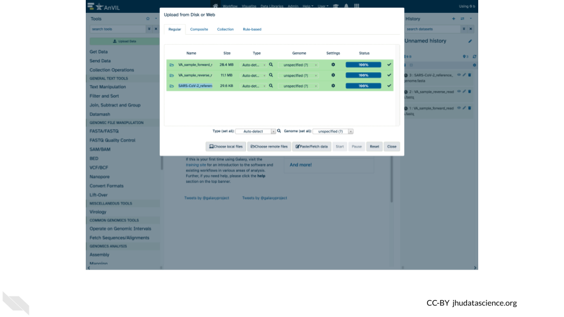
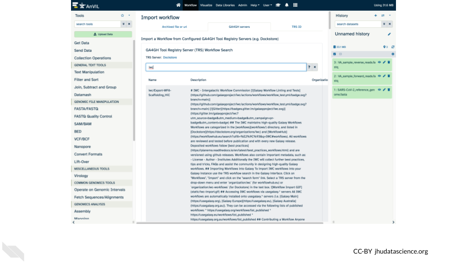
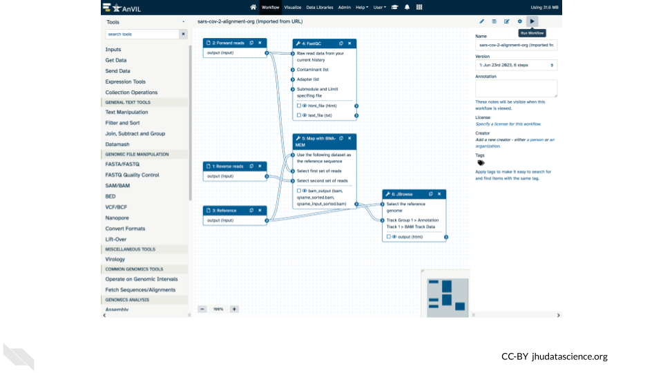
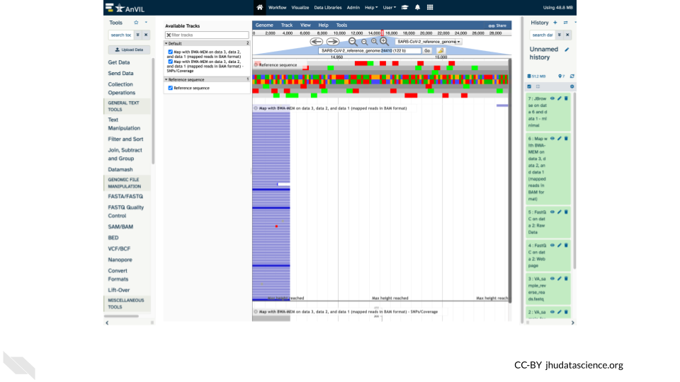
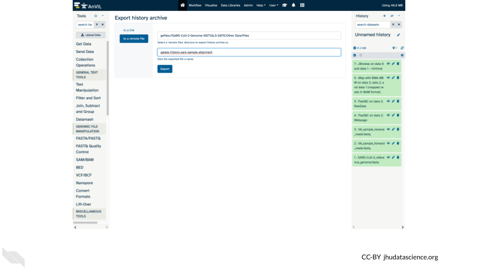
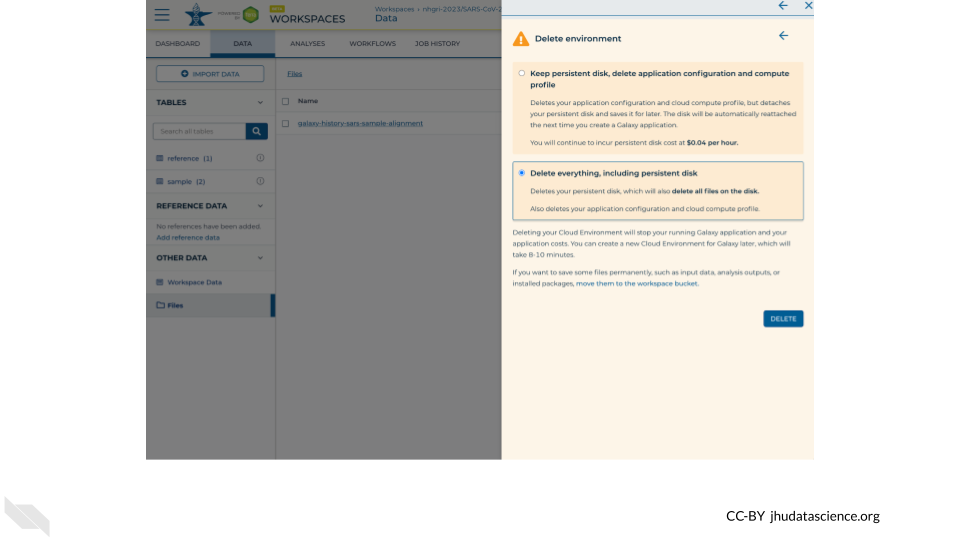

# (PART\*) Create Workflows With Galaxy {-}   

# Overview {#create-workflows-with-galaxy-overview}

## Learning Objectives

1. Learn how to launch Galaxy in AnVIL and import data
1. Understand how to find, import, and run workflows
1. Visualize a sample variant using JBrowse
1. Learn how to save your history back to AnVIL
1. Show how to shut down Galaxy in AnVIL

# Preparation {#create-workflows-with-galaxy-preparation}

## Review Key Concepts

This 5-min video provides a high level summary of the exercises to follow.  Several important concepts are introduced to provide context for the exercises ([slides](https://docs.google.com/presentation/d/1nZIlyA-YIxRDYUiozl1UTXIhJJeBb7VbqlXWig7jXAk)).

## Clone Workspace

:::{.notice}
For this demo, you will need your own copy of the [`SARS-CoV-2-Genome`](https://anvil.terra.bio/#workspaces/gdscn-exercises/SARS-CoV-2-Genome) Workspace.  These instructions will walk you through cloning a copy of the Workspace.
:::

## Start Cloud Environment

:::: {.borrowed_chunk}

Note that, in order to use Galaxy, you must have access to a Terra Workspace with permission to compute (i.e. you must be a "Writer" or "Owner" of the Workspace).

Open your Workspace, and click on the “Environment configuration” button, a cloud icon on the righthand side of the screen. 

Under Galaxy, click on “Create new Environment”. Click on “Next” and “Create” to keep all settings as-is. This will take 8-10 minutes.

Click on "Open Galaxy" when the environment is ready.

::::

# Exercises {#create-workflows-with-galaxy-exercises}

## Import Data

## Find Workflow

## Run Workflow

## Explore Results

## Export History

## Shut Down

# Instructor Guide {#create-workflows-with-galaxy-instructor-guide}

## Timeline

