# (PART\*) Run a Tool With Galaxy {-}   

# Overview {#run-tool-with-galaxy-overview}

This chapter contains instructions for the SARS-CoV-2 sequencing data FastQC analysis with Galaxy on AnVIL activity.

Galaxy is a free computing platform that allows users to upload or "fetch" data from online repositories and analyze that data with supported tools using a [point and click user interface](https://en.wikipedia.org/wiki/Point_and_click) (UI) rather than with a [command-line interface](https://en.wikipedia.org/wiki/Command-line_interface). Galaxy on AnVIL means that the benefits of AnVIL (such as secure data sharing, access to controlled access data) are combined with the benefits of running a reproducible analysis with Galaxy. 

Like all compute on AnVIL, Galaxy on AnVIL will incur costs. 

## Learning Objectives

This activity will teach you how to use the AnVIL platform to:

1. Launch Galaxy on AnVIL
1. Import data into Galaxy on AnVIL
1. Examine sequence data files (`.fastq` files)
1. Find, open, and run a tool (FastQC)
1. Examine the quality control summary report (Webpage)
1. Export your results for future viewing
1. Show how to shut down Galaxy on AnVIL

# Getting Started {#run-tool-with-galaxy-getting-started}

## Account Login

If you don't have an AnVIL account, you will need to create one using the steps below in the AnVIL Account Creation Dropdown section.

Expand for AnVIL account creation instructions

:::: {.borrowed_chunk}

In order to run your analyses, you will use the [AnVIL cloud computing platform](https://anvilproject.org/).  The AnVIL (Analysis Visualization and Informatics Lab-space) platform is specially designed for analyzing biological data, and is used by scientists doing all sorts of biological research.

:::{.notice}
**AnVIL in a nutshell**

- Behind the scenes, AnVIL relies on Google Cloud Platform to provide computing infrastructure.  Basically, AnVIL lets you "rent" computers through the internet. The analysis is run on the rented computer. AnVIL lets you see the results in your browser.
- AnVIL uses [Terra](https://anvil.terra.bio/) to provide many computational tools useful for biological data analysis, such as [RStudio](https://www.rstudio.com/products/rstudio/), [Galaxy](https://usegalaxy.org/), and [Jupyter Notebooks](https://jupyter.org/).  Terra takes care of installing these tools so you can use them right away.
:::

### Create Google Account

First, you will need to set up a (free) Google account.

A Google account usually looks like "`myname@gmail.com`". Alternatively, you can enable Google for an existing non-Gmail email address using [these instructions](https://support.terra.bio/hc/en-us/articles/360029186611).

If you do not already have a Google account that you would like to use for accessing AnVIL, [create one now](https://accounts.google.com/SignUp).

### Log In to Terra

Next, make sure you can log in to Terra -- you will use Terra to perform computations on AnVIL. 

You can access Terra by going to [`anvil.terra.bio`](https://anvil.terra.bio/). Open Terra, and you should be prompted to sign in with your Google account.

### Share Username

Make sure your instructor has your Google account username (e.g. `myname@gmail.com`), so they can give you access to everything you need.

- Make sure there are no typos!
- If you have multiple Google accounts, make sure you give them the username that you will be using to log in to `anvil.terra.bio`.

:::{.warning}
It is *very important* that you share the Google account you will be using to access AnVIL with with your instructor! Otherwise, the instructor cannot add you to Billing Projects or Workspaces, and you will be unable to proceed with your assignments.
:::
::::

 Once you have an account, you can login and access Terra by going to [`anvil.terra.bio`](https://anvil.terra.bio/). Open Terra, and you should be prompted to sign in with your Google account.

## Workspace Set Up

Workspaces are the building blocks of projects in Terra. Inside a Workspace, you can run analyses, launch interactive tools like RStudio and Galaxy, store data, and share results. 

Cloning an existing Workspace allows you to copy existing documentation, code, and/or data into your own experimental space. The data for this activity is already available on AnVIL, specifically the [`demos-galaxy-fastqc` workspace](https://anvil.terra.bio/#workspaces/anvil-outreach/demos-galaxy-fastqc), so you'll want to clone the repository. 

When cloning, AnVIL makes a copy of notebooks and code for you to modify. Data however, is linked back to the original Workspace through Data Tables, which saves space!

::: {.notice}
The screenshots included below show a different workspace than what this tutorial will be using. For this tutorial, you want to clone the [`demos-galaxy-fastqc` workspace](https://anvil.terra.bio/#workspaces/anvil-outreach/demos-galaxy-fastqc) 

Be sure to name the cloned workspace a unique name in step 6. We recommend adding `_yourfirstname_yourlastname` to the workspace name.
:::

:::: {.borrowed_chunk}

:::{.warning}
This **will not work** until your instructor has given you permission to spend money to "rent" the computers that will power your analyses (by adding you to a "Billing Project").
:::

On AnVIL, you access files and computers through **Workspaces**.  Each Workspace functions almost like a mini code laboratory - it is a place where data can be examined, stored, and analyzed. The first thing we want to do is to copy or “clone” a Workspace to create a space for you to experiment.  This will give you access to

- the files you will need (data, code)
- the computing environment you will use

:::{.notice}
**Tip**
At this point, it might make things easier to open up a new window in your browser and split your screen. That way, you can follow along with this guide on one side and execute the steps on the other.
:::

To clone an AnVIL Workspace:

1. Open Terra - use a web browser to go to [`anvil.terra.bio`](https://anvil.terra.bio/)

1. In the drop-down menu on the left, navigate to "Workspaces". Click the triple bar in the top left corner to access the menu. Click "Workspaces".

    

1. You are automatically directed to the "MY WORKSPACES" tab.  Here you can see any Workspaces that have been shared with you, along with your permission level.  Depending on how your instructor has set things up, you may or may not see any Workspaces in this tab.

    
    
1. Locate the Workspace **demos-galaxy-fastqc**.  (The images below show the SARS-CoV-2-Genome Workspace as an example, but you should look for the Workspace  **demos-galaxy-fastqc**.)
    a. If it has been shared with you ahead of time, it will appear in "MY WORKSPACES".  

    
    b. Otherwise, select the "PUBLIC" tab.  In the top search bar, type the Workspace name **demos-galaxy-fastqc**.

    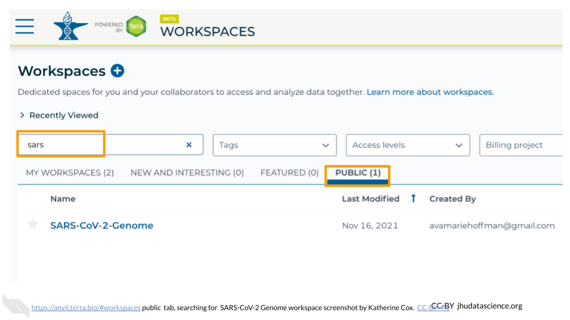
    c. You can also go directly to the Workspace by clicking this link: https://anvil.terra.bio/#workspaces/anvil-outreach/demos-galaxy-fastqc.
    
1. Clone the workspace by clicking the teardrop button ({width=25px}). Select "Clone".  Or, if you have opened the Workspace, you can find the teardrop button on the top right of the Workspace.

    
    

1. You will see a popup box appear, asking you to configure your Workspace
    a. Give your Workspace clone a name by adding an underscore ("_") and your name. For example, \"demos-galaxy-fastqc_Firstname_Lastname\".
    a. Select the Billing Project sri-lanka-2025.
    a. Leave the bottom two boxes as-is.
    a. Click “CLONE WORKSPACE”.
    
    

1. The new Workspace should now show up under "MY WORKSPACES".  You now have your own copy of the Workspace to work in.
::::

# Activity {#run-tool-with-galaxy-activity}

## Launching Galaxy on AnVIL

:::: {.borrowed_chunk}

Note that, in order to use Galaxy, you must have access to a Terra Workspace with permission to compute (i.e. you must be a "Writer" or "Owner" of the Workspace).

Open your Workspace, and click on the “Environment configuration” button, a cloud icon on the righthand side of the screen. 

Under Galaxy, click on “Create new Environment”. Click on “Next” and “Create” to keep all settings as-is. This will take 8-10 minutes.

Click on "Open Galaxy" when the environment is ready.

::::

### Navigating Galaxy on AnVIL

:::: {.borrowed_chunk}

Notice the three main sections.

**Tools** - These are all of the bioinformatics tool packages available for you to use.

**The Main Dashboard** - This contains flash messages and posts when you first open Galaxy, but when we are using data this is the main interface area.

**History** - When you start a project you will be able to see all of the documents in the project in the history. Now be aware, this can become very busy. Also the naming that Galaxy uses is not very intuitive, so you must make sure that you label your files with something that makes sense to you.

On the welcome page, there are links to tutorials. You may try these out on your own. If you want to try a new analysis this is a good place to start.
::::

## Importing Data into Galaxy on AnVIL

When we cloned our workspace, our cloned workspace linked to the original data! We will upload three files from the AnVIL workspace into Galaxy, though we need only one `fastq` data sequence file for our activity. The others will be used if you want to continue with a related activity that performs alignment and variant discovery after quality control. These three files are (1) the forward and (2) the reverse reads for our sample, as well as, (3) the reference genome for SARS-CoV-2. There are two sets of reads for our sample because the scientists who collected it used [paired-end sequencing](https://en.wikipedia.org/wiki/Shotgun_sequencing#Paired-end_sequencing). The sample files we are looking at end in `fastq` because they are raw data from the sequencer. The reference genome ends in `.fasta` because it has already been cleaned up by scientists. 

1. Click on “Upload Data” in the Tools pane.  

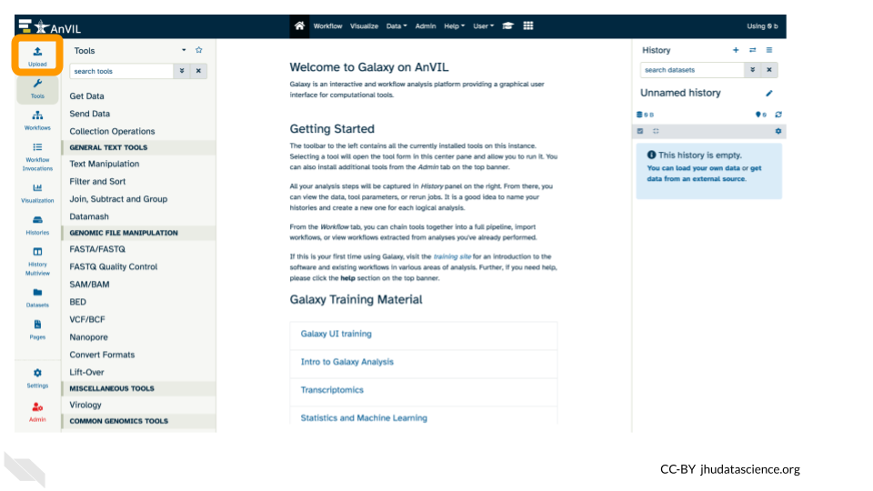

2. Click on “Choose remote files” at the bottom of the popup.

::: {.notice}
If you had files locally on your computer that you wanted to upload, you would use the "Choose local file" button.

Or if you had files you wanted to import from a data repository like Zenodo, you would use the "Paste/Fetch data" button.

We're using the "Choose remote files" button because we have data in our AnVIL workspace that we can import into the Galaxy on AnVIL instance.
:::

3. Double-click the Workspace folder.

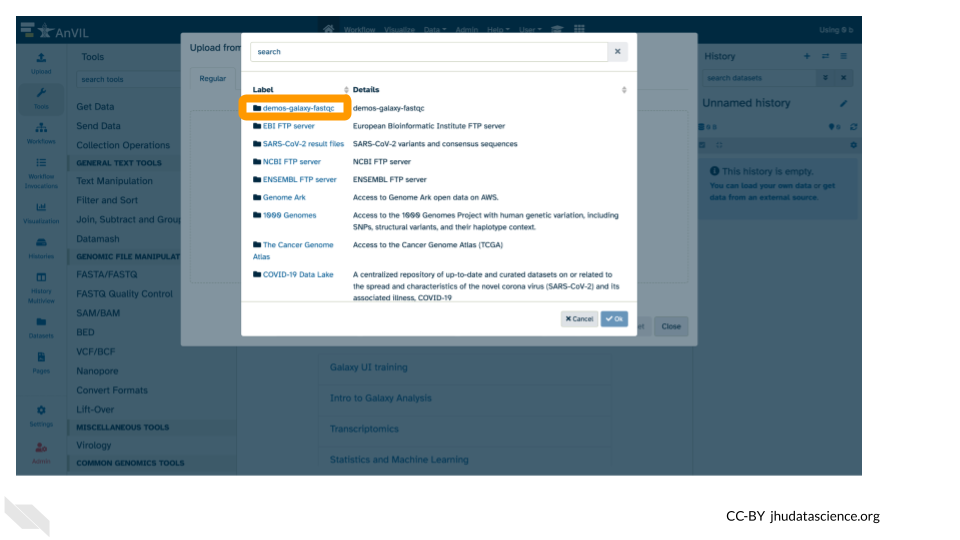

4. Upload the sample sequence data files

  - Double-click “Tables/”

  - Then double-click “sample/”.

  - Click the two sample `.fastq` file checkboxes to select them.

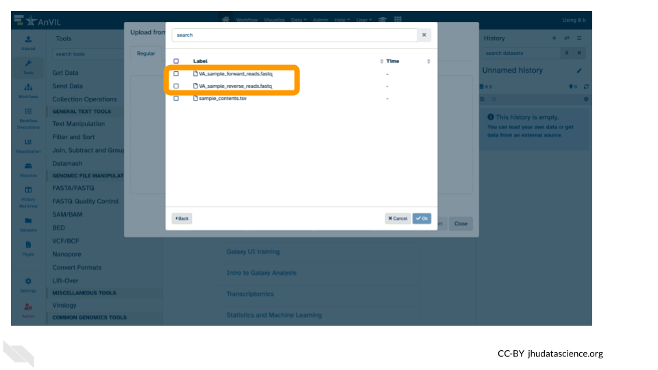

  - These files will be highlighted in green when ready. Click “Ok”.

Expand for Steps 5- 6: Upload the reference genome

5. Repeat steps 2 and 3 from above.

  - Click on “Choose remote files” at the bottom of the popup.

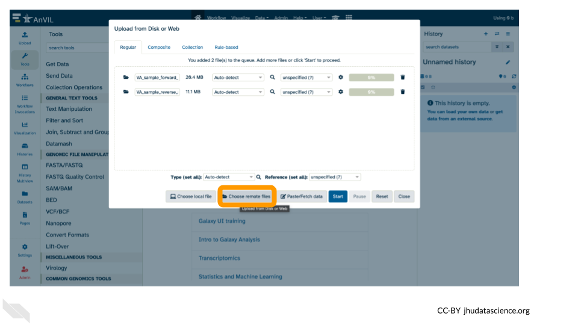

  - Double-click the Workspace folder.

6. Upload the reference genome file

  - Again, double click "Tables/".

  - This time, double click "reference/".

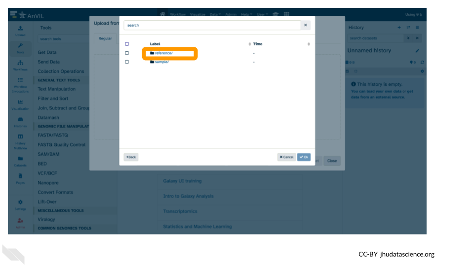

  - Click the `fasta` file.

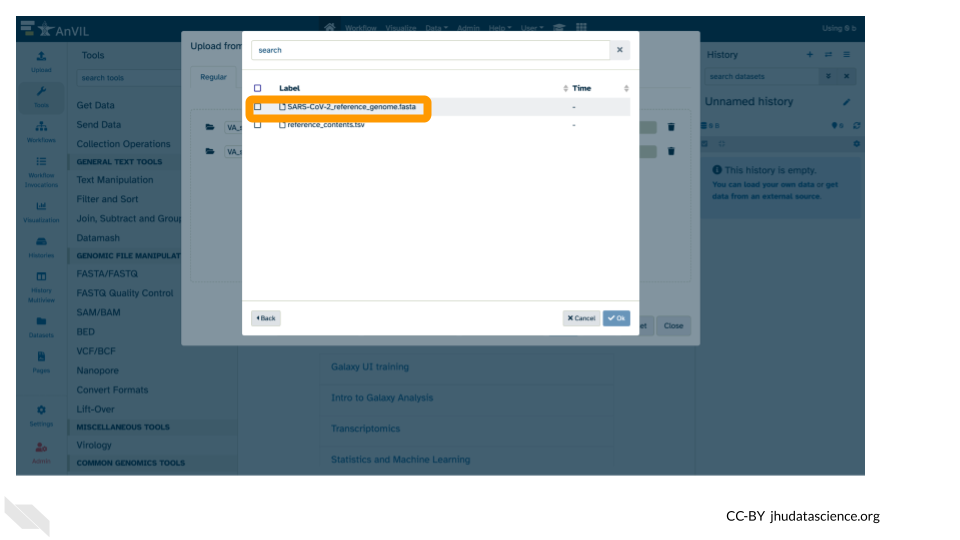

  - This file will be highlighted green and click "Ok".

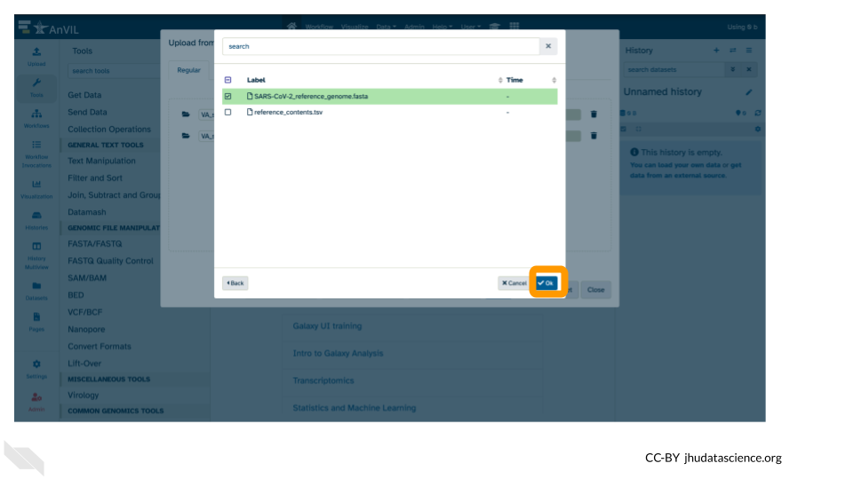

 
7. Click “Start”  

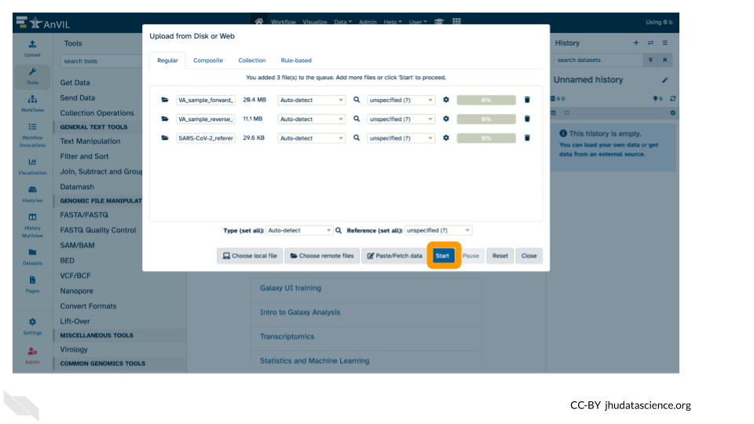

8. Once complete, click “Close”.

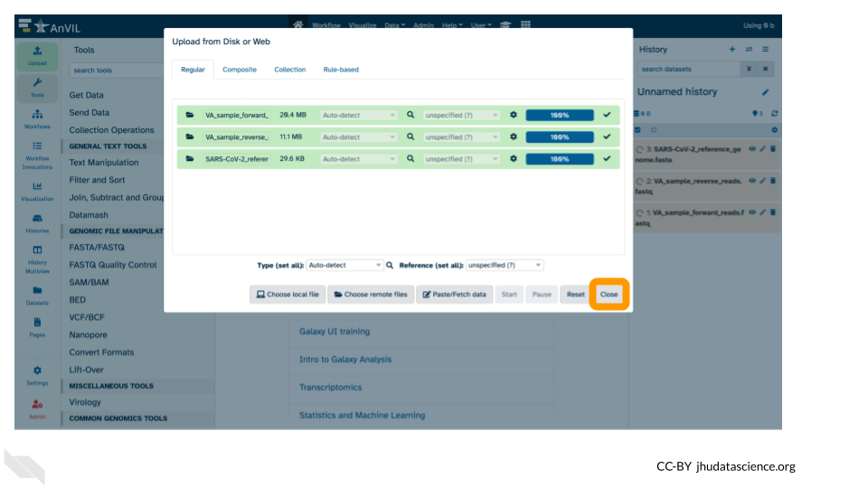

9. Confirm that the files uploaded successfully by looking at the file names in the Galaxy History pane.

Note that the files will be highlighted in green in the Galaxy History pane once they are uploaded and available.

## Examining `fastq` sequence data files

We will examine data in `fastq` format. This is the typical output from an Illumina Sequencer, but also the standard format output from most sequencers.

1. Use your mouse and click on the eye icon ({#id .class width=25 height=20px}) of the first `fastq` file (**VA_sample_forward_reads.fastq**). 

2. After clicking the eye icon, in the Main screen you will see something like this:

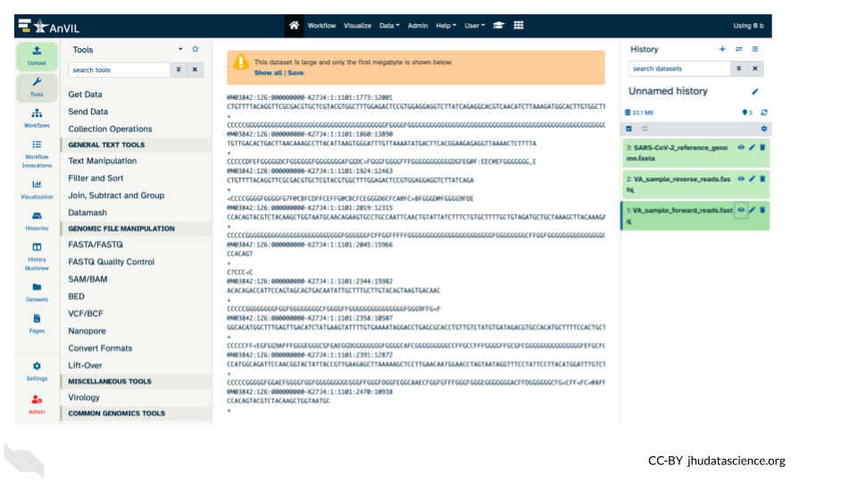

Expand for FASTQ files explained

For more information on the [contents of a FASTQ file, consider this resource from Illumina](https://knowledge.illumina.com/software/general/software-general-reference_material-list/000002211).

::: {.reflection}
QUESTIONS:

1. How many lines in a .fastq file represent an individual read?

2. What does each line represent?

3. Why is the final line for each read (the quality score) important?
:::

::: {.dictionary}
**Breakout Box: Learn more about quality scores**

To save space, the sequencer records an [ASCII character](http://drive5.com/usearch/manual/quality_score.html) to represent scores 0-42. For example 10 corresponds to “+” and 40 corresponds to “I”. FastQC (a tool we'll be using next) knows how to translate this. This way of encoding the data is often called “Phred” scoring.

What does 0-42 represent? These numbers, when plugged into a formula, tell us the probability of an error for that base. This is the formula, where Q is our quality score (0-42) and P is the probability of an error:

Q = -10 log10(P)

Using this formula, we can calculate that a quality score of 40 means only 0.00010 probability of an error!
:::

## Finding and Using FastQC

FastQC is a tool which aims to provide simple quality control checks on raw sequence data coming from high throughput sequencing pipelines. It provides a set of analyses which you can use to get a quick impression of whether your data has any problems of which you should be aware before doing any further analysis.

1. Use the search tools bar in the upper left (within the tools pane in Galaxy)

2. Type `fast` to search for FastQC, and select the tool in the list below.

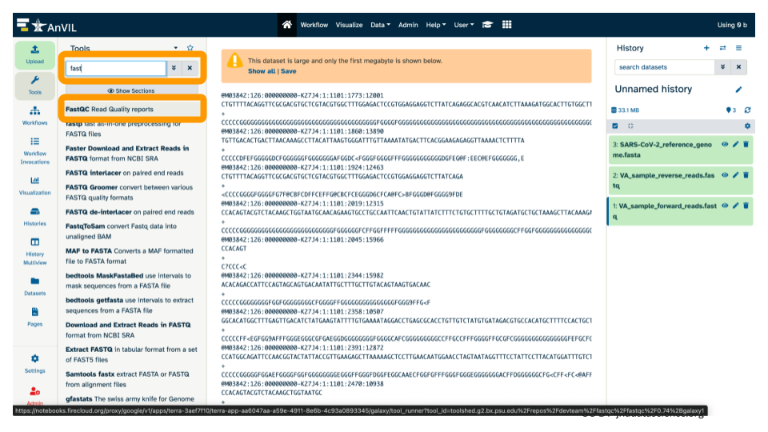

3. This will open the tool menu in the middle pane. 

4. Switch the version of FastQC to `0.73+galaxy0`

  - Select the Versions icon (3 cubes).

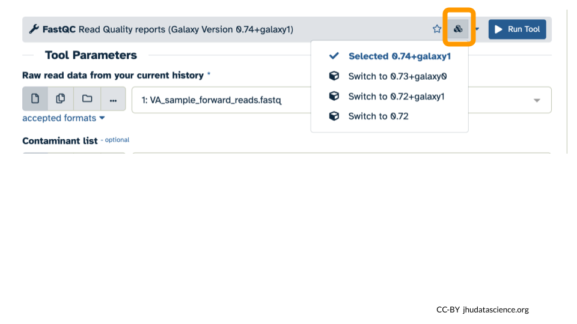

  - Select "Switch to 0.73+galaxy0" from the dropdown menu.

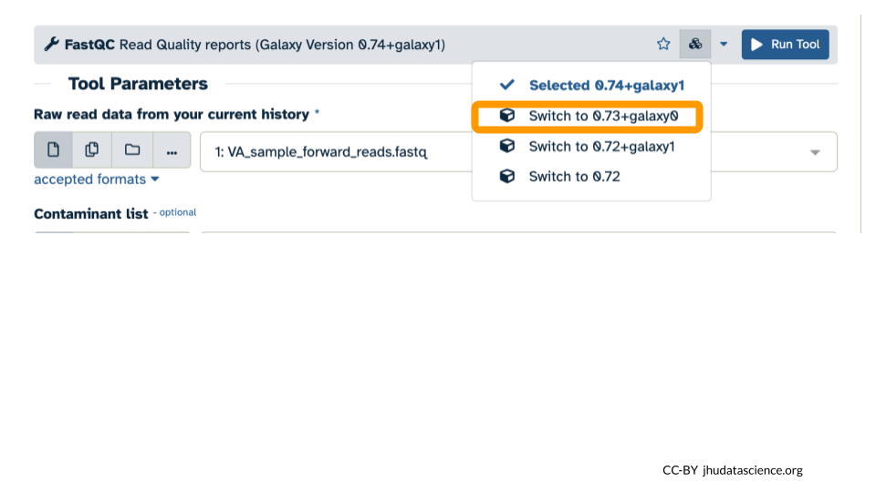

  - Confirm that the version now says "Selected 0.73+galaxy0".

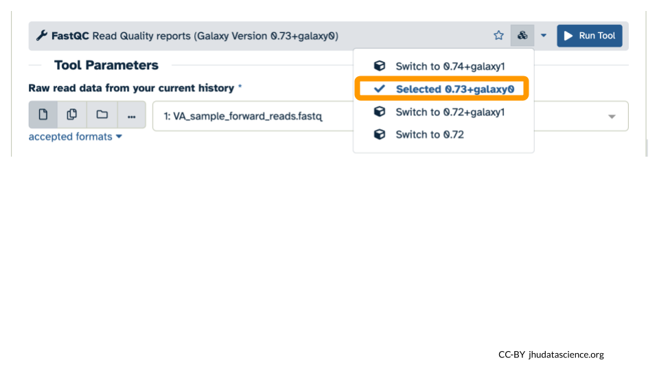

5. Confirm or select the correct input for FastQC (the forward reads fastq file).

6. Run FastQC by clicking the blue "Run Tool" button.

7. After submitting the job to run, the middle pane should have a message highlighted in green. 

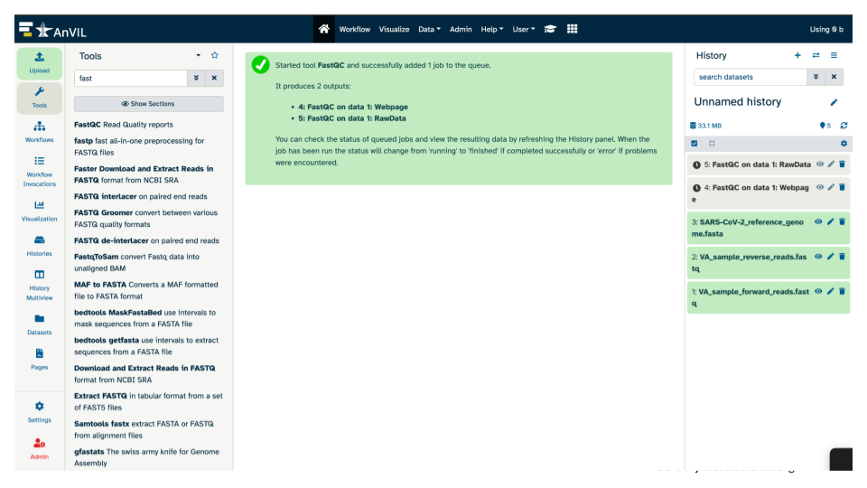

The history pane should also list what will be the output(s) from the tool. Note, before the job has finished running, these output(s) will be highlighted in gray. While running, the output(s) will be highlighted in an orange cream color. And once the tool runs successfully, the output(s) will be highlighted in green.

## Examining the FastQC quality control summary report

We will examine the FastQC output in webpage or `html` format. This form of the output provides graphs and a flag of "Passed", "Warn", or "Fail" for each subsection within the quality control analysis.

1. Use your mouse and click on the eye icon ({#id .class width=25 height=20px}) of the FastQC Webpage output (**FastQC on data 1: Webpage**). 

2. This will open up a summary report for the sequencing file in the middle pane that you can scroll.

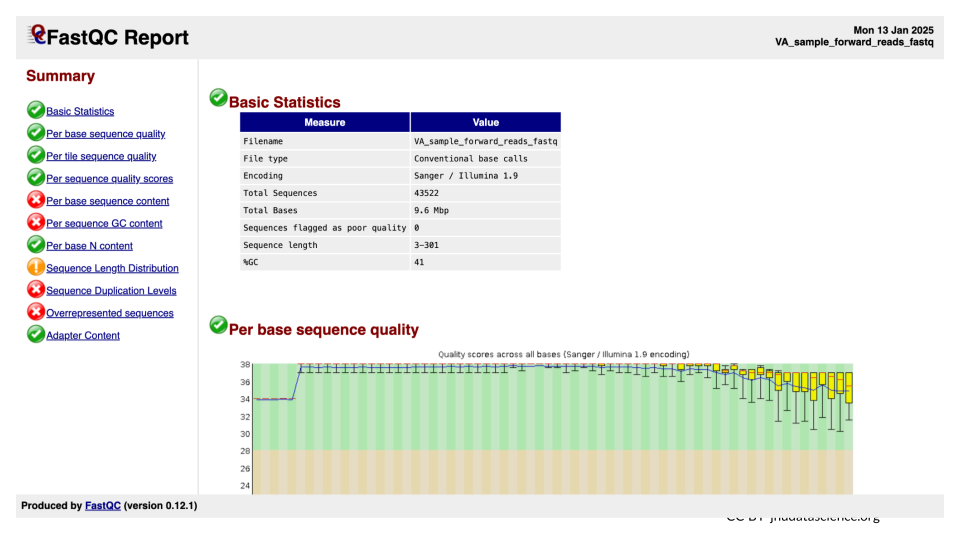

Expand for FastQC summary report explained

For more information on the [contents of the output quality control summary report from FastQC, consider this resource from Michigan State](https://rtsf.natsci.msu.edu/genomics/technical-documents/fastqc-tutorial-and-faq.aspx)

::: {.reflection}
QUESTIONS:

1. Explore “Basic Statistics”. How many total reads are there? Have any been flagged as poor quality? What is the sequence length?

2. Explore “Per base sequence quality”. Based on the Basic Statistics, is 28-40 a good or bad quality score? 

3. Is it okay to proceed based on the per base sequence quality?
:::

## Exporting your results

In case you want to view the results later, you can download the file. 

1.  Click on the name of the results you want to export/save, and it will expand the info shown for that file. Click the floppy disk/save icon.

This will download a zip (compressed) file with the results to your computer. Uncompress it to view it locally.

## Shutting down Galaxy on AnVIL

:::: {.borrowed_chunk}

Once you are done with your activity, you’ll need to shut down your Galaxy cloud environment. This frees up the cloud resources for others and minimizes computing cost. The following steps will delete your work, so make sure you are completely finished at this point. Otherwise, you will have to repeat your work from the previous steps.

Return to AnVIL, and find the Galaxy logo that shows your cloud environment is running. Click on this logo.

Next, click on "Settings". Click on "Delete Environment".

Finally, select "Delete everything, including persistent disk". Make sure you are done with the activity and then click "Delete".

::::

# Next steps {#run-tool-with-galaxy-next-steps}

This tutorial is just a first step in working with this data, specifically considering the quality scores of one set of the sequencing reads. Next steps include running FastQC on the reverse reads and downstream applications such as alignment and variant detection. Walk-throughs for these next steps can be found in [this Genomic Data Science Community Network Lab Exercise Book](https://jhudatascience.org/GDSCN_Book_SARS_Galaxy_on_AnVIL/student-activity-guide.html#alignment) or [this AnVIL Demos Recording](https://www.youtube.com/watch?v=_uT0IWL1wso).
