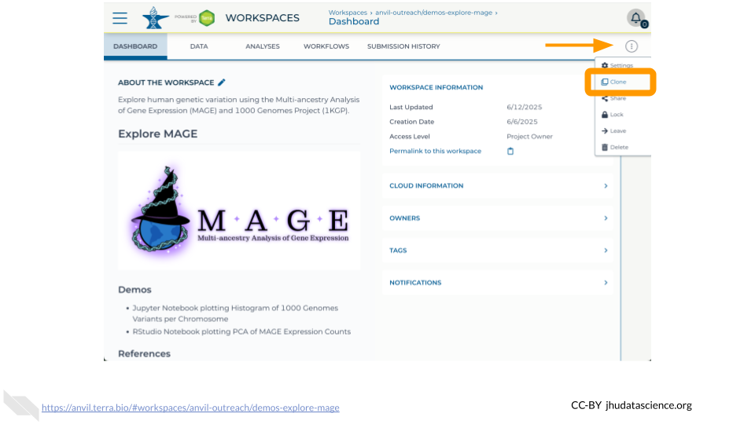
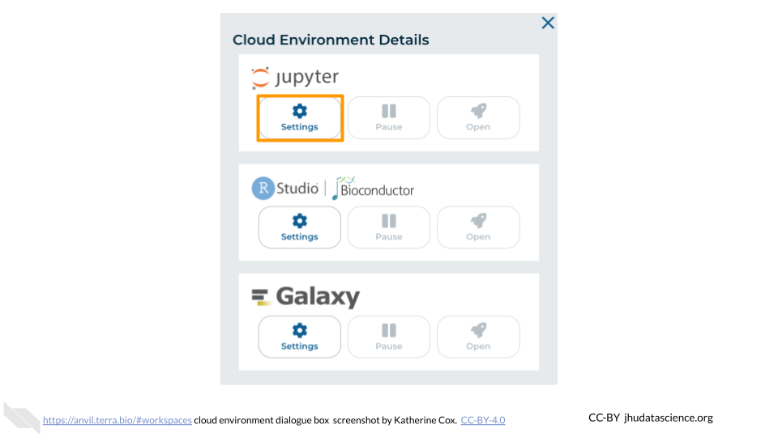
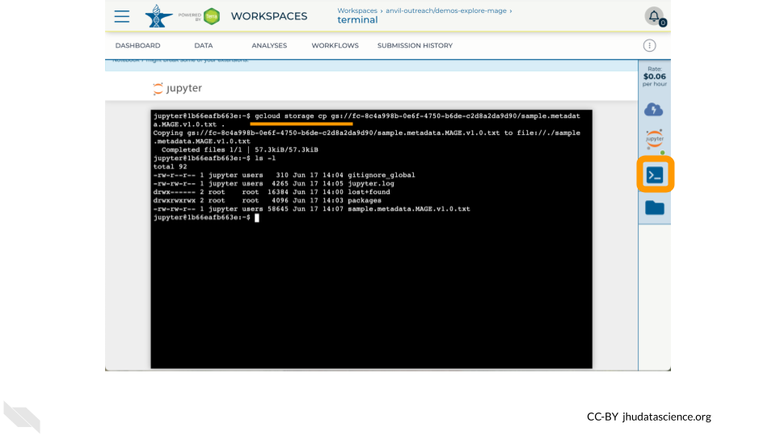
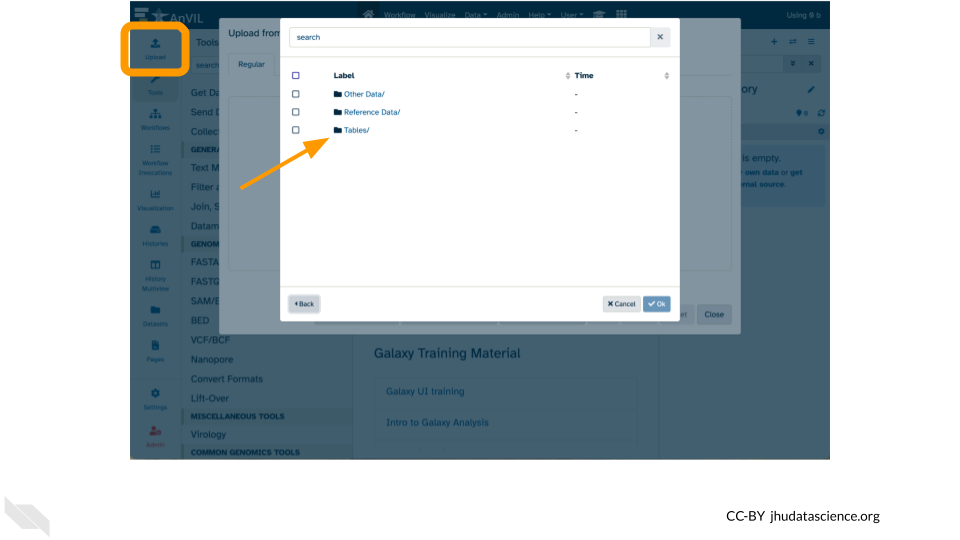
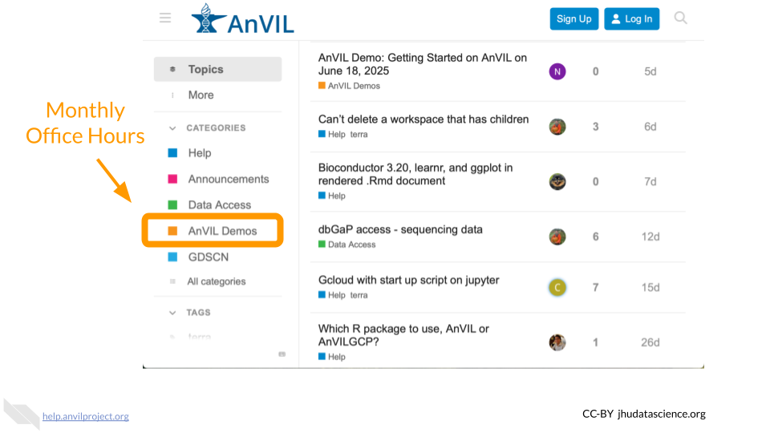

# (PART\*) Human Genetic Variation in MAGE {-}   

# Overview {#human-genetic-variation-in-mage-overview}

AnVIL provides a secure, scalable computing platform for controlled access data.
Hosting over 7 petabytes of data across 113 dbGaP accessions and 103 consent codes, AnVIL inverts the model of genomics data sharing by providing tools such as Jupyter, RStudio, Galaxy, and WDL Workflows.
This AnVIL Demo introduces datasets from the [MAGE](https://github.com/mccoy-lab/MAGE) and [1000 Genomes Project (1KGP)](https://www.internationalgenome.org/) projects to showcase notable features of working in AnVIL including how to import data and export results between these various tools.


This demonstration will specifically explore workspaces, noting how cloned workspaces differ from the original; run an analysis in a Jupyter Notebook, run an analysis using RStudio, and submit a workflow in Galaxy.
All analyses will showcase human genetic variation concepts and results from the MAGE and 1KGP datasets.

## Learning Objectives

1. Explore MAGE Workspace 
1. Analysis with Jupyter/Terminal
1. Bioconductor with RStudio
1. Workflows with Galaxy

# Preparation {#human-genetic-variation-in-mage-preparation}

## Review Background

Learn how the NHGRI Genomic Data Science Analysis, Visualization, and Informatics Lab-Space, or AnVIL, inverts the model of genomics data sharing by providing a cloud environment for the analysis of large genomic and related datasets (see [slidedeck](https://docs.google.com/presentation/d/16DHXD2KNyjjP2mKzPDHmNE9loYy6OgqGG0-Kn8CLFak/edit?slide=id.g336d9ca244f_0_6#slide=id.g336d9ca244f_0_6)).


## Create AnVIL Account

Follow these instructions to create an AnVIL Account

- https://jhudatascience.org/AnVIL_Book_Getting_Started/data-analysts.html#data-analysts-step-1

::: {.notice}
Fill out [this poll](https://docs.google.com/forms/d/e/1FAIpQLScEF5Z9alzqEM3XfFFCFTcBDdm2MxCciSaMRTPehALHz4CsiA/viewform) to share your AnVIL ID
:::


## Clone Workspace

Navigate to `demos-explore-mage` and clone the Workspace

- https://anvil.terra.bio/#workspaces/anvil-outreach/demos-explore-mage



# Exercises {#human-genetic-variation-in-mage-exercises}

## Explore MAGE Workspace

The demos-explore-mage Workspace allows you to explore how data is organized on AnVIL using a subset of data from the [Multi-ancestry Analysis of Gene Expression](https://pubmed.gov/39020179) (MAGE) and [1000 Genomes Project](https://www.internationalgenome.org) (1KGP) projects.
Importantly, pay close attention to the relationship between file **links** in Data Tables and the actual files in Workspace Buckets, especially after cloning a Workspace.
You can navigate to MAGE Workspace directly through this link: 

- https://anvil.terra.bio/#workspaces/anvil-outreach/demos-explore-mage

Key components of this Workspace are:

1. DASHBOARD tab - which will tell you more about the Workspace.
1. DATA tab - which has Data Tables with links to data relevant for demo exercises.
1. ANALYSES tab - which has notebooks relevant for demo exercises with Jupyter and RStudio.
1. 'Environment Configuration' button - to select the Cloud Environment of choice.
1. 'Browse workspace files' button - which contains any files stored in this Workspace (see Review Key Concepts for important note about Cloned Workspaces) as well as notebooks listed in the ANALYSES tab.

### Review Key Concepts


### Scavenger Hunt

In this exercise you will go on a scavenger hunt to explore the Original Workspace and your Cloned Workspace to look for and understand the differences between them.

The focus of this scavenger hunt within the Workspaces will be on:

1. Entries in Data Tables
2. Files in Workspace Buckets

Original Workspace

- https://anvil.terra.bio/#workspaces/anvil-outreach/demos-explore-mage
- Explore Data Tables e.g. counts.csv, PCA.nb.html
- Find files in Workspace Bucket

Your Cloned Workspace

- https://anvil.terra.bio/#workspaces/ &lt;billing-project&gt; / &lt;workspace-name&gt;
- Explore Data Tables
- Look for files in Workspace Bucket

## Analysis with Jupyter/Terminal

The Jupyter Cloud Environment allows for both interactive analysis using Jupyter Notebooks as well as a UNIX Terminal.
Pre-configured with conda, Python, R, and GATK, you can further personalize your environment using startup scripts and custom Docker images.
In this Workspace you will find a Jupyter Notebook demonstrating how to generate a quick summary of 1000 Genomes variants.
In this exercise you will learn how to: 

1. Launch Jupyter Cloud Environment in your Cloned Workspace.
1. Access a UNIX Terminal.
1. Transfer data using between Workspace Bucket and  Persistent Disk using `gcloud storage`
1. Run a Jupyter Notebook to plot a histogram of 1000 Genomes variants per chromosome.


### Launch Jupyter





### Review Key Concepts


### Enter Terminal

Copy a file from the original Workspace Bucket to your Persistent Disk using `gcloud storage`

```
gcloud storage cp gs://fc-8c4a998b-0e6f-4750-b6de-c2d8a2da9d90/sample.metadata.MAGE.v1.0.txt .
```



### Run Jupyter Notebook


## Bioconductor with RStudio

The next Cloud Environment we will explore is RStudio which comes pre-configured with support for both the recent and prior release of Bioconductor.
In 2024, the [Bioconductor project](https://www.bioconductor.org/about) provided almost 4,000 packages covering a “broad range of powerful statistical and graphical methods for the analysis of genomic data”.
AnVIL enables analysis using Bioconductor in a single secure environment with direct access to results from additional tools like Galaxy and WDL Workflows.
In this exercise you will learn how to:

1. Launch RStudio Cloud Environment in your Cloned Workspace.
2. Transfer data between your Workspace and Persistent Disk using the Bioconductor AnVILGCP package.
3. Run an R Notebook to make a PCA plot of MAGE RNA expression counts.


### Launch RStudio


### Review Key Concepts


### Use AnVILGCP

Copy a file to your Persistent Disk using the link in the Data Table and the Bioconductor [AnVILGCP](https://bioconductor.org/packages/AnVILGCP) package

```
BiocManager::install( "AnVILGCP" )
library( "AnVILGCP" )
avtable( "MAGE" )
gcloud_storage( paste( "cp", avtable( "MAGE" )[2,2], "." ) )
```


### Run R Notebook

Two notebooks are available showcasing notable features of Bioconductor and RStudio on AnVIL

- PCA.Rmd – Make a PCA plot of gene expression counts from MAGE, demonstrating how AnVILGCP facilitates access to Data Tables (`avtable()`) and Workspace Buckets (`gcloud_storage()`)
- eQTL.Rmd (requires using the  `install-conda.sh` startup script) – Visualize an eQTL (expression quantitative trait locus) correlated with expression of GSTP1, combining datasets from the MAGE and 1KGP Workspaces


## Workflows with Galaxy

[Galaxy](https://usegalaxy.org) is a free, open-source web-based platform for data intensive biomedical research.
Through its graphical-user interface, over 10,000 tools are ready to run without the need for software installation or prior coding experience.
In addition to providing a secure space for analysis and data sharing, Galaxy on AnVIL automatically grants you system administrator privileges, enabling you to install and soon configure any tool in the [toolshed](https://toolshed.g2.bx.psu.edu).

In this exercise you will learn how to: 

1. Launch Galaxy Environment in your Cloned Workspace.
1. Upload and export data from/to your Workspace Bucket.
1. Run a tool.
1. Install a tool.


### Launch Galaxy


### Review Key Concepts


### Run FastQC

Copy a file to your Persistent Disk using the Galaxy Upload tool

- Click "Upload" in the left hand menu
- Click "Choose remote files" at the bottom
- Select the `demos-explore-mage` Workspace
- Select `Tables` and then `1KGP`
- Tick the box next to `NA12878.1mil.fastq.gz` and click "Ok"
- Click "Start" and then "Close"

You can now

- Run the FastQC tool and view FastQC on data 1: Webpage
- Export data back to AnVIL using "Export History to File" (must target `Other Data/Files`)




### Install Tool


# Wrap Up {#human-genetic-variation-in-mage-wrap-up}

## Shut Down Compute


## Learn More




## Provide Feedback

::: {.notice}
Fill out [this poll](https://docs.google.com/forms/d/e/1FAIpQLScrDVb_utm55pmb_SHx-RgELTEbCCWdLea0T3IzS0Oj00GE4w/viewform?usp=pp_url&entry.1565230805=GBCC2025) to share your feedback
:::


