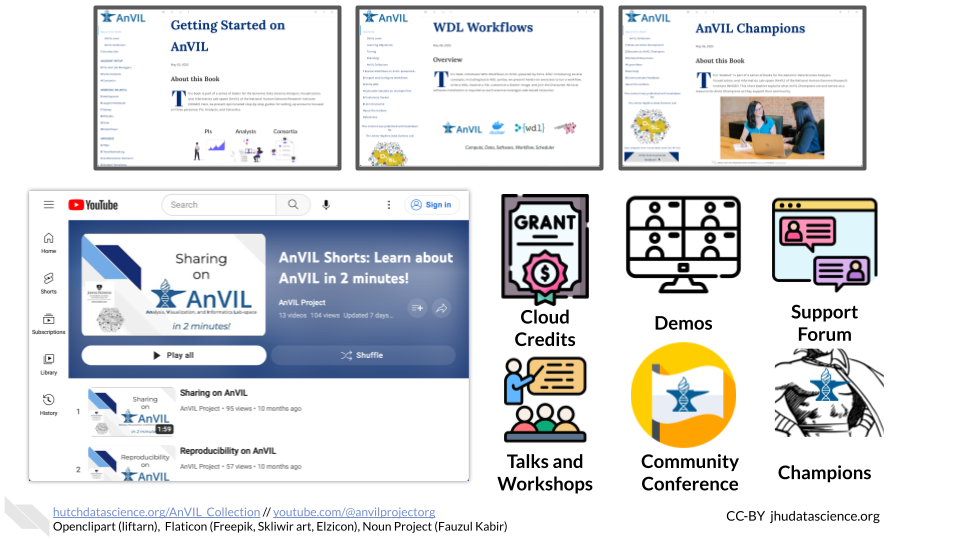
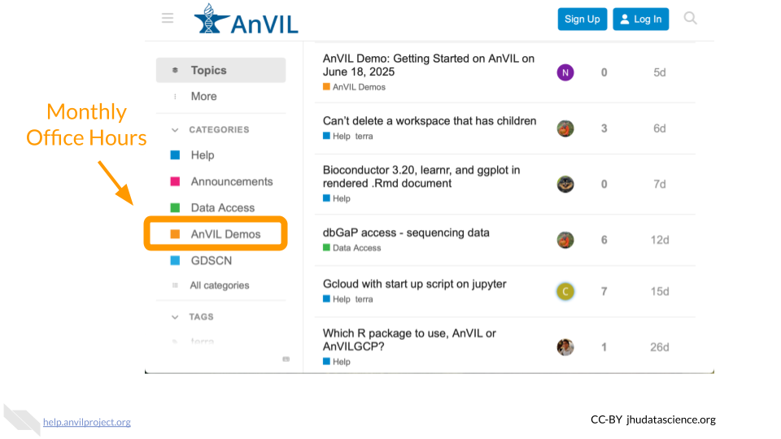
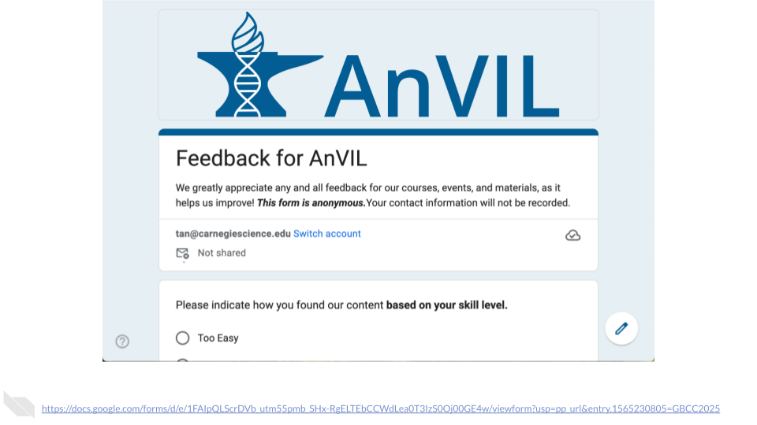

# (PART\*) MAGE mini-hackathon {-}

# Overview

Every dataset tells a story, yet deciphering exactly how a figure was constructed can feel like solving a puzzle with missing pieces. [Reproducibility](https://en.wikipedia.org/wiki/Reproducibility) is a common challenge. This mini-hackathon challenges teams to recreate figures from the MAGE RNA sequencing study using real omics data from the 1000 Genomes Project. Teams can also create additional visualizations from the open data. Through hands-on experience with cloud-based tools on AnVIL, participants will discover that computational reproducibility requires creativity, problem-solving, and detective work that go beyond simply following published protocols.

**References**:

-   Paper to reproduce here: <https://pmc.ncbi.nlm.nih.gov/articles/PMC11291278/>

-   Github repository companion for the paper here: <https://github.com/mccoy-lab/MAGE>

-   Data from the paper can be found here: <https://zenodo.org/records/10535719>

-   Original Workspace: <https://anvil.terra.bio/#workspaces/anvil-outreach/demos-mage-minihack>

## Locate the Startup Script

We will use a start up script when creating an RStudio Cloud Environment on AnVIL. Copy the path below: it will help us install `AnVILGCP`, `vcfR`, and `bcftools` automatically. The start-up script can be found in the original workspace under the [Data tab](https://anvil.terra.bio/#workspaces/anvil-outreach/demos-mage-minihack/data), under "Workspace Data", or in the [workspace files](https://anvil.terra.bio/#workspaces/anvil-outreach/demos-mage-minihack/files). 
For example, format of the start-up script would be: 
```         
gs://fc-9a141623-268f-47f8-8466-1747b5980b67/install-conda.sh
```

Here is a video tutorial on finding the path of the startup script: <iframe src="https://support.terra.bio/hc/article_attachments/360089799392" height="500" width="800" title="Tutorial"> </iframe>.

To read more on preconfiguring a Cloud Environment using startup scripts, click [here](https://support.terra.bio/hc/en-us/articles/360058193872-Preconfigure-a-Cloud-Environment-with-a-startup-script#h_01J5R7WP1WFDKV5H5P96883TXZ).

# Setting up your Workspace {#mini-hack-preparation}

1.  Clone the AnVIL workspace: <https://anvil.terra.bio/#workspaces/anvil-outreach/demos-mage-minihack>

-   For steps on launching Terra and cloning workspaces, read [here](https://hutchdatascience.org/AnVIL_Demos/what-is-anvil-exercises.html#launch-terra).

2.  Then, follow [these steps](https://hutchdatascience.org/AnVIL_Demos/human-genetic-variation-in-mage-exercises.html#launch-rstudio) to launch RStudio within your AnVIL workspace. 

3. Open `Reproducibility_in_Action.Rmd` and follow through the notebook. 
  - **Ensure that you replace _add your Google Project ID here_ with your Google Project ID in line 288 of your R Markdown file.**
  - To locate this information: In the dashboard page of your workspace, you will see **Google Project ID** under the Cloud Information section. The format of it will follow 'terra-xxxxxxxx'. 

4. At the end of the exercise, remember to shut down compute! Refer to steps [here](https://hutchdatascience.org/AnVIL_Demos/human-genetic-variation-in-mage-wrap-up.html#shut-down-compute).  

# Exercises

This hands-on activity will help you explore [MAGE](https://www.internationalgenome.org/data-portal/data-collection/mage_rnaseq), an open-access RNA sequencing dataset of lymphoblastoid cell lines from 731 individuals from the [1000 Genomes Project](https://www.internationalgenome.org/). As part of this exploration, we will attempt to recreate various figures from this [paper](https://pmc.ncbi.nlm.nih.gov/articles/PMC11291278/).

The GitHub repository can be found [here](https://github.com/mccoy-lab/MAGE).

Processed data can be found in Zenodo [here](https://zenodo.org/records/10535719) or in Dropbox [here](##0). 

By the end of this module, you will be able to: 

- Set up and manage an R analysis environment on AnVIL using cloud-native tools
- Import, reshape, and join multiple genomic data types (expression counts, sample metadata, variant calls, and genome annotations)
- Import data into an AnVIL workspace from multiple sources
- Apply core tidyverse operations including piping, filtering, joining, and mutation
- Extract and visualize expression quantitative trait loci (eQTL) data
- Reproduce figures from a peer-reviewed publication using open-access data
:::{.notice}
To follow along with these exercises, you will need to complete the steps described in the [Preparation](#mini-hack-preparation) guide for this demo.
:::
## Structure of steps

**Reminder**: The following steps are found in the detailed notebook `Reproducibility_in_Action.Rmd` in your workspace. To set up your workspace, read through [the steps here](setting-up-your-workspace.html#setting-up-your-workspace).

### Environment Setup

We will load the three required R packages (`tidyverse`, `vcfR`, `AnVILGCP`) and introduce how R packages work, including the distinction between installation and loading.

### Recreating Figure 5C: GSTP1 Expression by Genotype

1. **Importing Expression Counts**

We will copy a pre-loaded expression counts CSV from the workspace bucket using AnVILGCP functions, then read it into R.

2. **Reshaping Expression Data**

The wide-format counts matrix is transposed into tidy format using tidyverse operations, placing samples as rows and genes as columns.

3. **Importing Metadata**

Sample metadata is fetched from the bucket and read into R, providing population labels and other per-sample information.

4. **Joining Counts and Metadata**

The reshaped counts table and metadata are merged into a single object using an inner join on shared sample identifiers.

5. **Importing Reference Annotations**

The GENCODE v48 GTF annotation file is downloaded and parsed to identify the Ensembl ID for the gene of interest (GSTP1).

6. **Extracting Variant Data **

We will retrieve chromosome 11 variant calls from the 1000 Genomes high-coverage dataset, index the VCF, and use bcftools to subset the file to the specific SNP of interest (rs115070172, position chr11:67,559,635). The VCF is then read into R using vcfR.

7. **Combining Variants and Expression**

Genotype calls are joined to GSTP1 expression data, phased alleles are collapsed into unphased genotype groups, and per-genotype sample counts are computed and appended as plot labels.

8. **Visualization**

A combined violin and boxplot is produced using ggplot2, displaying log2-normalized GSTP1 counts stratified by rs115070172 genotype, closely matching the published figure.

### Recreating Figure 5D: GSTP1 Expression by Population

Building on the joined dataset, we will create a new column distinguishing Peruvian (PEL) from non-PEL samples using a conditional mutation, then produce an analogous violin/boxplot stratified by population label.

### Independent Extension: A Second eQTL

You will independently apply the full workflow to a second eQTL (rs7927381 × GSTP1), locating the SNP, subsetting the VCF, joining with expression data, and generating a comparable plot. 

### Additional Exploration

Several optional prompts are provided to you, including faceting plots by population or continental group, visualizing genotype frequency distributions, comparing GSTP1 expression by sex, and replicating Figure 1B using principal component data. 


## Learn More





## Provide Feedback

::: {.notice}
Fill out [this poll](https://docs.google.com/forms/d/e/1FAIpQLScrDVb_utm55pmb_SHx-RgELTEbCCWdLea0T3IzS0Oj00GE4w/viewform?usp=pp_url&entry.1565230805=AnVIL+Demos+Mini+Hack) to share your feedback
:::




